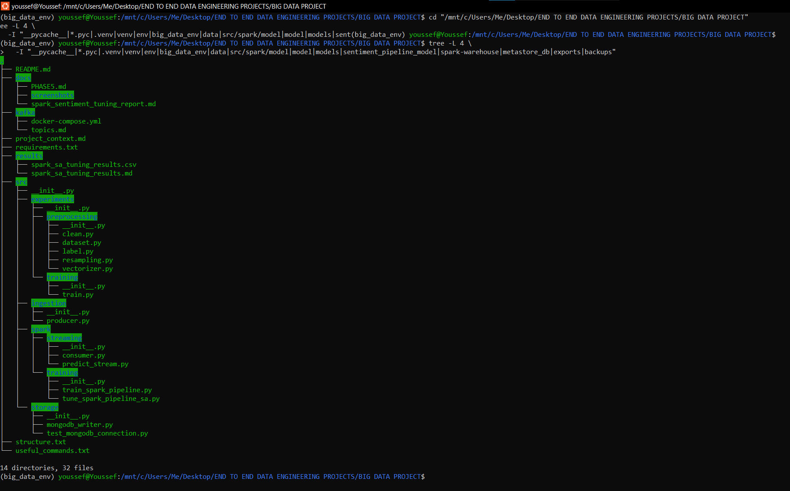
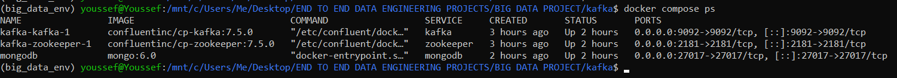
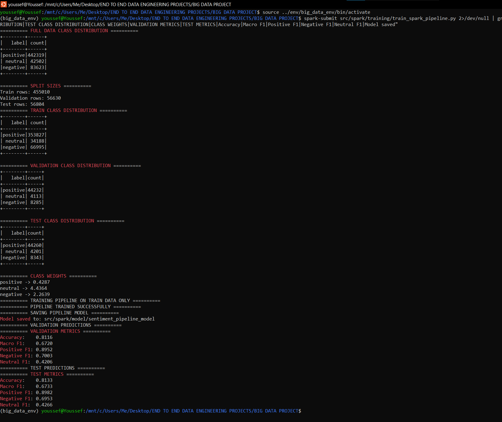
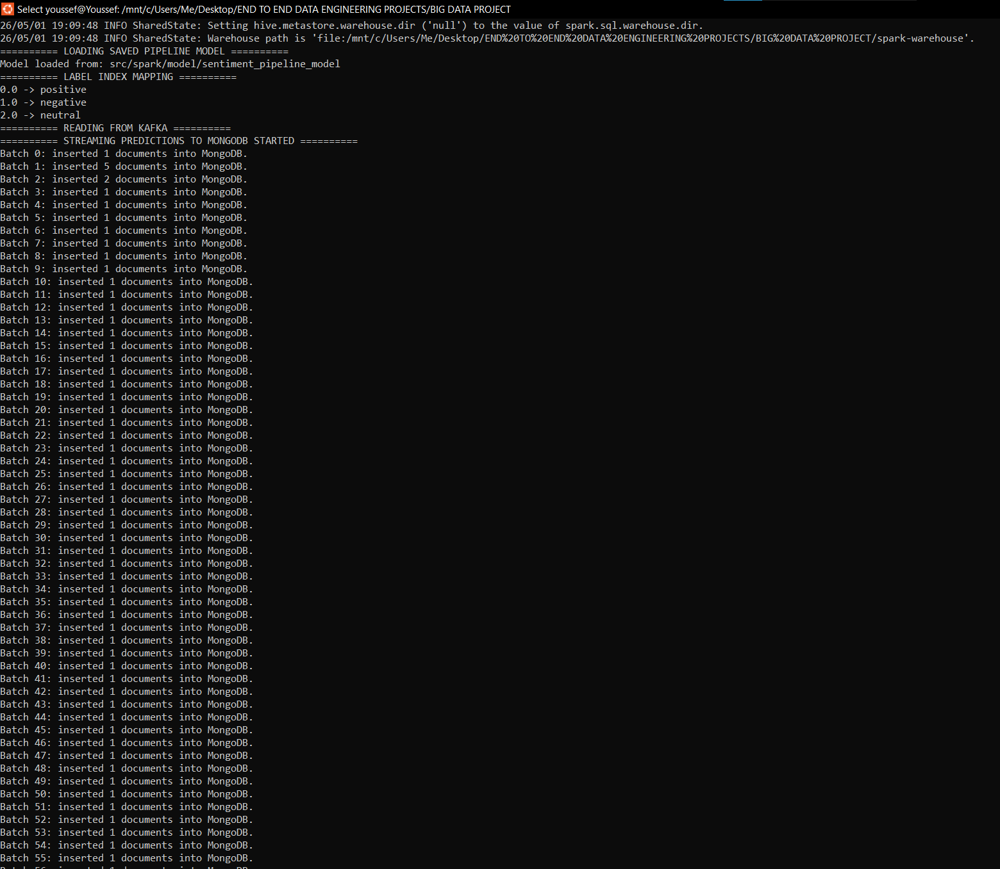
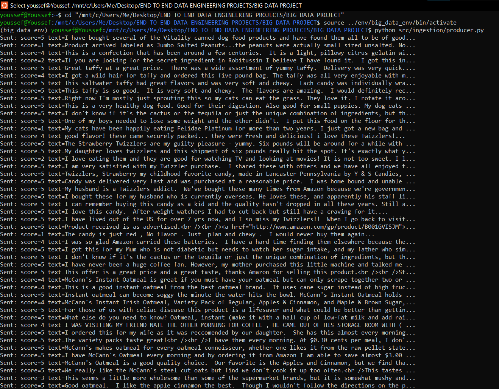
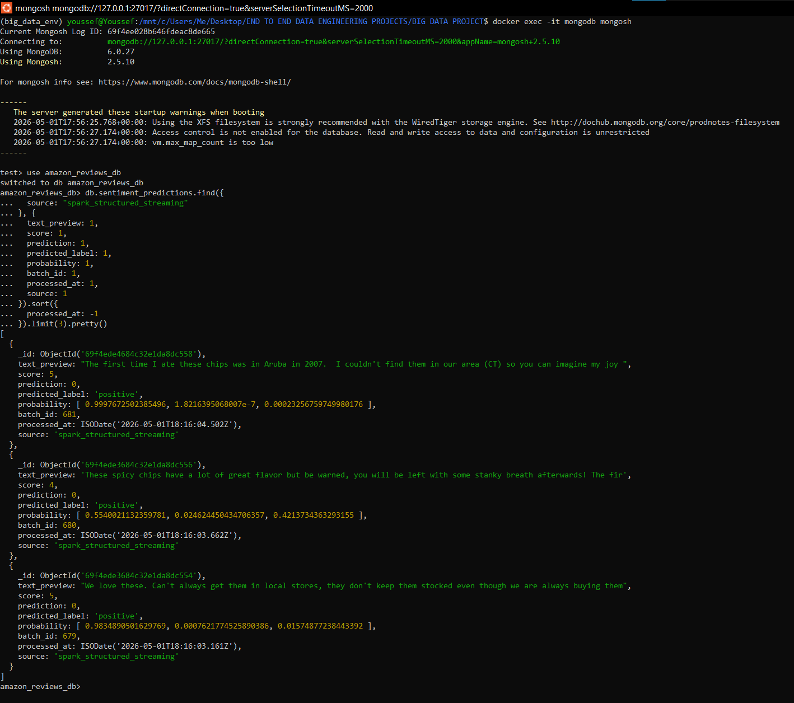
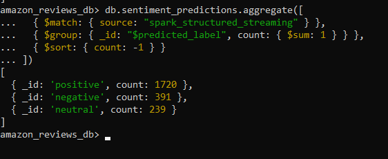
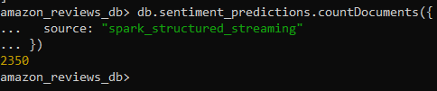

# Amazon Reviews Real-Time Sentiment Analysis Pipeline

A production-oriented Big Data project for real-time sentiment analysis on Amazon review events using Kafka, Apache Spark Structured Streaming, Spark ML, MongoDB, and a future dashboard layer.

The project is built phase by phase to simulate a real data engineering workflow: ingestion, distributed processing, machine learning inference, persistent storage, visualization, and orchestration.

---

## Table of Contents

1. [Project Objective](#1-project-objective)
2. [Current Project Status](#2-current-project-status)
3. [Architecture](#3-architecture)
4. [Dataset](#4-dataset)
5. [Repository Structure](#5-repository-structure)
6. [Completed Phases](#6-completed-phases)
7. [Spark ML Training Pipeline](#7-spark-ml-training-pipeline)
8. [Model Tuning Summary](#8-model-tuning-summary)
9. [Final Full-Data Model Metrics](#9-final-full-data-model-metrics)
10. [Streaming Inference](#10-streaming-inference)
11. [MongoDB Storage](#11-mongodb-storage)
12. [Screenshots](#12-screenshots)
13. [How to Run the Project](#13-how-to-run-the-project)
14. [Git and Artifact Rules](#14-git-and-artifact-rules)
15. [Next Phase: Dashboard](#15-next-phase-dashboard)
16. [Future Work](#16-future-work)

---

## 1. Project Objective

The objective is to build a complete real-time Big Data and machine learning pipeline:

```text
Amazon Reviews Dataset
→ Kafka
→ Spark Structured Streaming
→ Spark ML Sentiment Prediction
→ MongoDB
→ Dashboard
```

The fixed target architecture is:

```text
Producer → Kafka → Spark → MongoDB → Dashboard
```

The goal is not only to make the system work, but also to understand the role of every component in a realistic data engineering architecture.

---

## 2. Current Project Status

Completed:

- Kafka producer that streams Amazon review events.
- Kafka topic used for review ingestion.
- Spark-only ML training pipeline.
- Train/validation/test split.
- Class-weighted Logistic Regression.
- TF-IDF feature extraction using Spark ML.
- Unigram + bigram feature engineering.
- Simulated Annealing hyperparameter tuning.
- Final Spark `PipelineModel` training on the full dataset.
- Spark Structured Streaming inference from Kafka.
- Real-time sentiment predictions written to MongoDB.
- MongoDB validation queries for latest predictions, counts, and sentiment distribution.

Current completed architecture:

```text
Producer → Kafka → Spark Structured Streaming → Full-data Spark ML Model → MongoDB
```

Next phase:

```text
Phase 10 — Dashboard from MongoDB
```

---

## 3. Architecture

### Current Working Architecture

```text
Reviews.csv
   ↓
src/ingestion/producer.py
   ↓
Kafka topic: amazon_reviews
   ↓
src/spark/streaming/predict_stream.py
   ↓
Saved Spark PipelineModel
   ↓
Real-time sentiment prediction
   ↓
MongoDB
```

### Target Architecture

```text
Reviews.csv
   ↓
Kafka Producer
   ↓
Kafka
   ↓
Spark Structured Streaming
   ↓
Spark ML Prediction
   ↓
MongoDB
   ↓
Dashboard
```

---

## 4. Dataset

The project uses the **Amazon Fine Food Reviews** dataset.

Expected local path:

```text
data/raw/Reviews.csv
```

Main columns used:

| Column | Description |
|---|---|
| `Text` | Review text |
| `Score` | Review rating from 1 to 5 |

Sentiment labels are derived from `Score`:

| Score condition | Label |
|---|---|
| `Score < 3` | `negative` |
| `Score == 3` | `neutral` |
| `Score > 3` | `positive` |

The raw dataset is excluded from Git because it is large and must remain local.

---

## 5. Repository Structure

Current production-oriented structure:

```text
BIG DATA PROJECT/
│
├── docs/
│   ├── PHASE5.md
│   ├── screenshots/
│   └── spark_sentiment_tuning_report.md
│
├── kafka/
│   ├── docker-compose.yml
│   └── topics.md
│
├── results/
│   ├── spark_sa_tuning_results.csv
│   └── spark_sa_tuning_results.md
│
├── src/
│   ├── __init__.py
│   │
│   ├── experiments/
│   │   ├── preprocessing/
│   │   │   ├── clean.py
│   │   │   ├── dataset.py
│   │   │   ├── label.py
│   │   │   ├── resampling.py
│   │   │   └── vectorizer.py
│   │   │
│   │   └── training/
│   │       └── train.py
│   │
│   ├── ingestion/
│   │   └── producer.py
│   │
│   ├── spark/
│   │   ├── streaming/
│   │   │   ├── consumer.py
│   │   │   └── predict_stream.py
│   │   │
│   │   └── training/
│   │       ├── train_spark_pipeline.py
│   │       └── tune_spark_pipeline_sa.py
│   │
│   └── storage/
│       ├── mongodb_writer.py
│       └── test_mongodb_connection.py
│
├── project_context.md
├── README.md
├── requirements.txt
├── structure.txt
└── useful_commands.txt
```

Local-only generated folders and files are ignored by Git:

```text
data/raw/
src/spark/model/
src/spark/models/
.venv/
__pycache__/
exports/mongodb/
backups/mongodb/
```

---

## 6. Completed Phases

### Phase 1 — Kafka Streaming

Built:

- Kafka and Zookeeper using Docker Compose.
- Kafka topic: `amazon_reviews`.
- Producer that streams Amazon reviews from `Reviews.csv`.
- Basic consumer for testing.

Kafka message format:

```json
{
  "text": "review text here",
  "score": 5
}
```

The `score` is included because the stream replays historical data. The model prediction is based on the review text.

---

### Phase 2 — Data Preparation and TF-IDF Experiments

Built an early Python/sklearn experimentation layer:

- Text cleaning.
- Lowercasing.
- Regex cleaning.
- Stopword removal.
- Lemmatization.
- TF-IDF vectorization.

Important learning:

```text
Fit TF-IDF only on training data.
Transform validation and test data using the fitted training vectorizer.
```

This avoids data leakage.

---

### Phase 3 — Dataset Creation

Built:

- CSV loading.
- Text and score selection.
- Sentiment label creation.
- Train/validation/test split.

Split:

```text
Train: 80%
Validation: 10%
Test: 10%
```

The test set is kept untouched until final evaluation.

---

### Phase 4 — Initial Spark ML Training

Built an early Spark Logistic Regression model using:

```text
Python/sklearn TF-IDF
→ manual conversion to Spark SparseVector
→ Spark ML Logistic Regression
```

This was useful for learning, but later replaced with a Spark-only pipeline for production and streaming compatibility.

---

### Phase 5 — Validation and Imbalance Handling

Implemented:

- Accuracy.
- Confusion matrix.
- Precision.
- Recall.
- F1-score per class.

Finding:

```text
Accuracy alone is not enough because the dataset is imbalanced.
```

The dataset is dominated by positive reviews, while neutral reviews are the smallest and hardest class.

---

### Phase 6 — Testing

The test set was used only after model selection.

Important rule:

```text
Validation is used for tuning.
Test is used only for final evaluation.
```

---

### Phase 7 — Model Selection

Selected model family:

```text
TF-IDF + Logistic Regression
```

Reason:

- Simple and interpretable.
- Stable validation and test performance.
- Good baseline for a real-time streaming pipeline.
- Easy to save and reload as a Spark `PipelineModel`.

---

### Phase 8 — Spark Streaming Inference

Completed:

```text
Producer → Kafka → Spark Structured Streaming → Saved Spark ML Model → Console Predictions
```

The script:

```text
src/spark/streaming/predict_stream.py
```

loads the saved Spark `PipelineModel`, reads Kafka messages, applies the model, maps numeric predictions back to readable labels, and originally printed results to the console.

---

### Phase 9 — MongoDB Storage

Completed:

```text
Producer → Kafka → Spark Structured Streaming → Spark ML Prediction → MongoDB
```

MongoDB was added as a persistent storage layer. Spark streaming predictions are written to MongoDB using `foreachBatch`.

---

## 7. Spark ML Training Pipeline

The production training file is:

```text
src/spark/training/train_spark_pipeline.py
```

The Spark-only pipeline:

```text
text
→ RegexTokenizer
→ StopWordsRemover
→ NGram
→ CountVectorizer for unigrams
→ IDF for unigrams
→ CountVectorizer for bigrams
→ IDF for bigrams
→ VectorAssembler
→ StringIndexer
→ Class-weighted Logistic Regression
```

The final selected hyperparameters:

```python
vocab_size = 10000
min_df = 4
max_iter = 15
reg_param = 0.000025
use_bigrams = True
```

The model is saved locally to:

```text
src/spark/model/sentiment_pipeline_model
```

This folder is ignored by Git because it is a generated model artifact.

---

## 8. Model Tuning Summary

Tuning was done with both manual tests and Simulated Annealing.

Tuning file:

```text
src/spark/training/tune_spark_pipeline_sa.py
```

The tuning process tested:

- Vocabulary size.
- Minimum document frequency.
- Logistic Regression iterations.
- Regularization.
- Unigrams vs. unigrams + bigrams.

Important finding:

```text
Unigrams + bigrams improved minority-class performance.
```

Macro F1 was the main tuning metric because the dataset is imbalanced.

---

## 9. Final Full-Data Model Metrics

The final Spark ML model was trained on the full Amazon Reviews dataset.

### Full Dataset Class Distribution

| Label | Count |
|---|---:|
| positive | 442,319 |
| negative | 83,623 |
| neutral | 42,502 |

Total rows:

```text
568,444
```

### Split Sizes

| Split | Rows |
|---|---:|
| Train | 455,010 |
| Validation | 56,630 |
| Test | 56,804 |

### Class Weights

| Label | Weight |
|---|---:|
| positive | 0.4287 |
| negative | 2.2639 |
| neutral | 4.4364 |

### Validation Metrics

| Metric | Value |
|---|---:|
| Accuracy | 0.8116 |
| Macro F1 | 0.6720 |
| Positive F1 | 0.8952 |
| Negative F1 | 0.7003 |
| Neutral F1 | 0.4206 |

### Test Metrics

| Metric | Value |
|---|---:|
| Accuracy | 0.8133 |
| Macro F1 | 0.6733 |
| Positive F1 | 0.8982 |
| Negative F1 | 0.6953 |
| Neutral F1 | 0.4266 |

The final model generalizes well because validation and test metrics are close.

---

## 10. Streaming Inference

Streaming prediction file:

```text
src/spark/streaming/predict_stream.py
```

The script:

1. Creates a Spark session.
2. Loads the saved Spark `PipelineModel`.
3. Reads from Kafka topic `amazon_reviews`.
4. Parses JSON messages.
5. Adds schema-compatible dummy columns required by the saved pipeline.
6. Applies model prediction.
7. Converts numeric prediction to readable sentiment label.
8. Writes the results to MongoDB.

The readable label mapping is learned from the saved `StringIndexerModel`. In the current model:

```text
0.0 → positive
1.0 → negative
2.0 → neutral
```

---

## 11. MongoDB Storage

MongoDB is used as the persistent storage layer for streaming prediction results.

MongoDB target:

```text
URI: mongodb://localhost:27017
Database: amazon_reviews_db
Collection: sentiment_predictions
```

Storage writer file:

```text
src/storage/mongodb_writer.py
```

Spark writes predictions to MongoDB using:

```python
foreachBatch(write_predictions_to_mongodb)
```

This approach processes each Spark micro-batch as a batch DataFrame and writes documents using `insert_many()`.

Each prediction document contains:

| Field | Description |
|---|---|
| `text_preview` | Short preview of the review text |
| `text` | Full review text |
| `score` | Original review score, kept for checking |
| `prediction` | Numeric Spark prediction |
| `predicted_label` | Readable sentiment label |
| `probability` | Model probability distribution |
| `batch_id` | Spark micro-batch ID |
| `processed_at` | Timestamp of MongoDB insertion |
| `source` | Data source marker |

Example document structure:

```json
{
  "text_preview": "This product is excellent...",
  "text": "This product is excellent and I would buy it again...",
  "score": 5,
  "prediction": 0.0,
  "predicted_label": "positive",
  "probability": [0.97, 0.01, 0.02],
  "batch_id": 12,
  "processed_at": "2026-05-01T18:16:04Z",
  "source": "spark_structured_streaming"
}
```

MongoDB validation after the final streaming test:

| Predicted label | Stored documents |
|---|---:|
| positive | 1,720 |
| negative | 391 |
| neutral | 239 |

Total Spark streaming prediction documents:

```text
2,350
```

---

## 12. Screenshots

### Project structure



### Docker services running



### Full-data model training metrics



### Spark streaming predictions written to MongoDB



### Producer streaming Amazon reviews to Kafka



### MongoDB latest prediction documents



### MongoDB sentiment distribution



### MongoDB prediction count



---

## 13. How to Run the Project

### 13.1 Start Docker Services

From the project root:

```bash
cd kafka
docker compose up -d
docker compose ps
```

Expected services:

```text
kafka
zookeeper
mongodb
```

---

### 13.2 Train the Final Spark Model

From the project root:

```bash
spark-submit src/spark/training/train_spark_pipeline.py
```

For cleaner metric output:

```bash
spark-submit src/spark/training/train_spark_pipeline.py 2>/dev/null | grep -A 20 -E "==========|Accuracy|Correct predictions|Total predictions|positive|negative|neutral|label_index|class_index"
```

---

### 13.3 Run the Full Streaming Pipeline

Use three terminals.

#### Terminal 1 — Docker Services

```bash
cd kafka
docker compose up
```

#### Terminal 2 — Spark Streaming Prediction

```bash
export PYTHONPATH=$PWD

spark-submit \
  --packages org.apache.spark:spark-sql-kafka-0-10_2.12:3.2.4 \
  src/spark/streaming/predict_stream.py
```

#### Terminal 3 — Kafka Producer

```bash
python src/ingestion/producer.py
```

Expected Spark output:

```text
Batch 1: inserted 1 documents into MongoDB.
Batch 2: inserted 1 documents into MongoDB.
Batch 3: inserted 1 documents into MongoDB.
```

---

### 13.4 Validate MongoDB Results

Open MongoDB shell:

```bash
docker exec -it mongodb mongosh
```

Use the project database:

```javascript
use amazon_reviews_db
```

Count Spark streaming predictions:

```javascript
db.sentiment_predictions.countDocuments({
  source: "spark_structured_streaming"
})
```

Show latest predictions:

```javascript
db.sentiment_predictions.find({
  source: "spark_structured_streaming"
}, {
  text_preview: 1,
  score: 1,
  prediction: 1,
  predicted_label: 1,
  probability: 1,
  batch_id: 1,
  processed_at: 1,
  source: 1
}).sort({
  processed_at: -1
}).limit(3).pretty()
```

Show sentiment distribution:

```javascript
db.sentiment_predictions.aggregate([
  { $match: { source: "spark_structured_streaming" } },
  { $group: { _id: "$predicted_label", count: { $sum: 1 } } },
  { $sort: { count: -1 } }
])
```

---

## 14. Git and Artifact Rules

The following files and folders should not be committed:

```text
data/raw/
src/spark/model/
src/spark/models/
.venv/
__pycache__/
exports/mongodb/
backups/mongodb/
```

Reason:

- `data/raw/Reviews.csv` is too large for GitHub.
- Spark saved models are generated artifacts.
- MongoDB exports/backups can become large.
- Python environments and cache files are local runtime files.

The repository should contain:

```text
Code
Configuration
Documentation
Small results/reports
Screenshots
```

---

## 15. Next Phase: Dashboard

Next phase:

```text
Phase 10 — Dashboard
```

Recommended first dashboard:

```text
MongoDB → Streamlit Dashboard
```

The dashboard should read from:

```text
mongodb://localhost:27017
amazon_reviews_db.sentiment_predictions
```

First dashboard version should show:

- Total number of predictions.
- Positive / negative / neutral counts.
- Sentiment distribution chart.
- Latest prediction documents.
- Review text previews.
- Prediction confidence values.
- Basic refresh behavior.

The dashboard should not read MongoDB physical database files. It should connect to MongoDB as a database service.

---

## 16. Future Work

Planned next improvements:

- Build Streamlit dashboard from MongoDB.
- Add filtering by predicted label.
- Add latest reviews table.
- Add confidence visualization.
- Add optional export from MongoDB to JSON.
- Add Airflow orchestration later.
- Add Dockerized dashboard service.
- Add monitoring and better logging.
- Improve model tracking and reproducibility.
