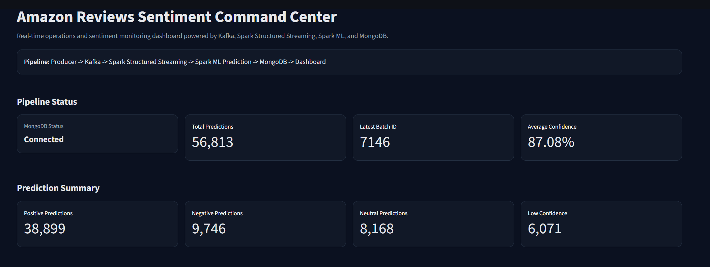
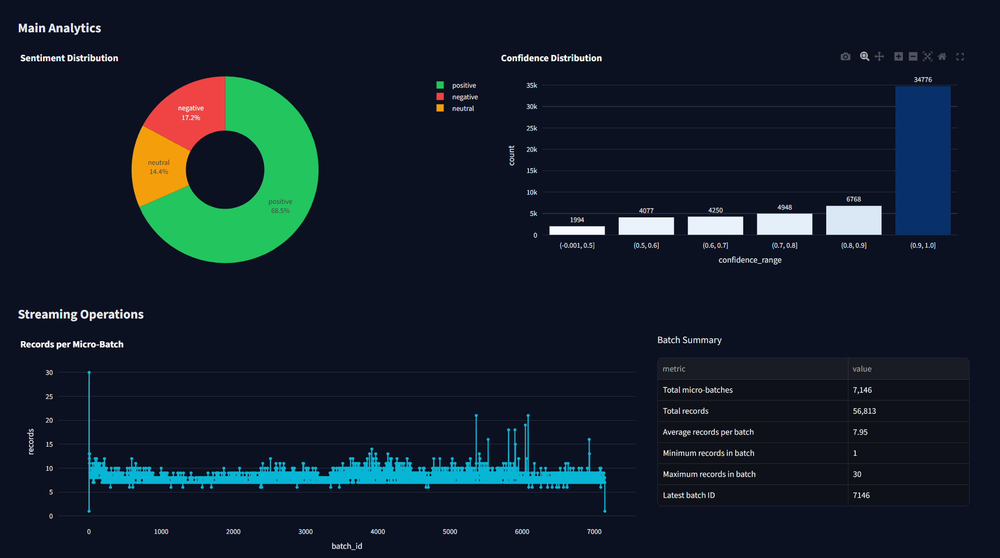
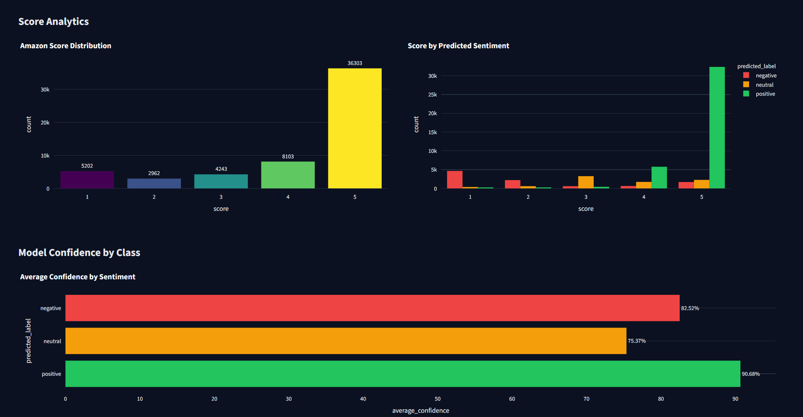
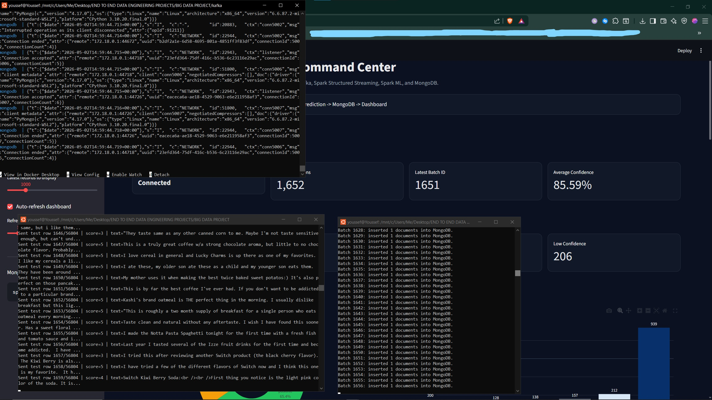

# Amazon Reviews Real-Time Sentiment Command Center

A production-oriented Big Data project that streams Amazon review events through Kafka, applies Spark ML sentiment prediction with Spark Structured Streaming, stores predictions in MongoDB, and visualizes operational analytics in a Streamlit dashboard.

This project was built phase by phase as a practical data engineering training lab: ingestion, streaming, distributed processing, machine learning inference, storage, dashboarding, validation, and documentation.

---

## Table of Contents

1. [Project Objective](#1-project-objective)
2. [Current Status](#2-current-status)
3. [Architecture](#3-architecture)
4. [Tech Stack](#4-tech-stack)
5. [Dataset](#5-dataset)
6. [Repository Structure](#6-repository-structure)
7. [Completed Phases](#7-completed-phases)
8. [Spark ML Training Pipeline](#8-spark-ml-training-pipeline)
9. [Final Model Metrics](#9-final-model-metrics)
10. [Streaming Inference](#10-streaming-inference)
11. [MongoDB Storage](#11-mongodb-storage)
12. [Streamlit Dashboard](#12-streamlit-dashboard)
13. [Screenshots](#13-screenshots)
14. [How to Run](#14-how-to-run)
15. [MongoDB Validation Commands](#15-mongodb-validation-commands)
16. [Git and Artifact Rules](#16-git-and-artifact-rules)
17. [Future Improvements](#17-future-improvements)

---

## 1. Project Objective

The objective is to build a complete real-time Big Data sentiment analysis pipeline:

```text
Amazon Reviews Dataset
→ Kafka
→ Spark Structured Streaming
→ Spark ML Prediction
→ MongoDB
→ Streamlit Dashboard
```

The project simulates a real data engineering workflow where raw events are ingested continuously, processed by a distributed streaming engine, enriched with machine learning predictions, stored in a database, and monitored through a dashboard.

---

## 2. Current Status

Current completed architecture:

```text
Producer → Kafka → Spark Structured Streaming → Spark ML Prediction → MongoDB → Dashboard
```

Completed:

- Kafka and Zookeeper running with Docker Compose.
- MongoDB running as a Docker service.
- Kafka producer streaming Amazon review events.
- Spark-only ML training pipeline.
- TF-IDF feature engineering using unigrams and bigrams.
- Class-weighted Logistic Regression for imbalanced sentiment classes.
- Simulated Annealing hyperparameter tuning.
- Final Spark `PipelineModel` saved locally.
- Spark Structured Streaming inference from Kafka.
- Prediction documents written to MongoDB.
- Streamlit dashboard connected to MongoDB.
- Dashboard KPIs, charts, filters, live refresh, confidence analytics, risk monitoring, latest events table, and PDF report export.

Next recommended phase:

```text
Portfolio cleanup → README polish → GitHub push → optional Airflow/Docker improvements
```

---

## 3. Architecture

### High-Level Architecture

```text
                ┌──────────────────────┐
                │  Amazon Reviews CSV  │
                └──────────┬───────────┘
                           │
                           ▼
                ┌──────────────────────┐
                │ Kafka Producer       │
                │ src/ingestion        │
                └──────────┬───────────┘
                           │ JSON events
                           ▼
                ┌──────────────────────┐
                │ Kafka Topic          │
                │ amazon_reviews       │
                └──────────┬───────────┘
                           │ stream read
                           ▼
                ┌──────────────────────┐
                │ Spark Structured     │
                │ Streaming            │
                └──────────┬───────────┘
                           │
                           ▼
                ┌──────────────────────┐
                │ Spark ML Pipeline    │
                │ TF-IDF + LogisticReg │
                └──────────┬───────────┘
                           │ predictions
                           ▼
                ┌──────────────────────┐
                │ MongoDB              │
                │ sentiment_predictions│
                └──────────┬───────────┘
                           │ query
                           ▼
                ┌──────────────────────┐
                │ Streamlit Dashboard  │
                │ Command Center       │
                └──────────────────────┘
```

### Runtime Data Flow

```text
producer.py
→ Kafka topic: amazon_reviews
→ predict_stream.py
→ saved Spark PipelineModel
→ mongodb_writer.py
→ amazon_reviews_db.sentiment_predictions
→ dashboard/app.py
```

---

## 4. Tech Stack

| Layer | Tool |
|---|---|
| Programming | Python |
| Message Broker | Apache Kafka |
| Containerized Services | Docker Compose |
| Streaming Processing | Apache Spark Structured Streaming |
| Machine Learning | Spark MLlib |
| Feature Engineering | RegexTokenizer, StopWordsRemover, CountVectorizer, IDF, NGram, VectorAssembler |
| Model | Logistic Regression |
| Storage | MongoDB |
| Dashboard | Streamlit + Plotly |
| Reporting | ReportLab PDF export |
| Environment | WSL/Linux recommended |

---

## 5. Dataset

Dataset:

```text
Amazon Fine Food Reviews
```

Expected local path:

```text
data/raw/Reviews.csv
```

Main columns used:

| Column | Role |
|---|---|
| `Text` | Review text used for prediction |
| `Score` | Original Amazon rating from 1 to 5 |

Sentiment labeling rule:

| Score condition | Sentiment label |
|---|---|
| `Score < 3` | `negative` |
| `Score == 3` | `neutral` |
| `Score > 3` | `positive` |

The raw CSV is not committed to Git because it is large.

---

## 6. Repository Structure

Recommended current structure:

```text
BIG DATA PROJECT/
│
├── docs/
│   ├── PHASE5.md
│   ├── screenshots/
│   │   ├── 01_project_structure.png
│   │   ├── 02_docker_services_running.png
│   │   ├── 03_full_training_metrics.png
│   │   ├── 04_spark_streaming_to_mongodb.png
│   │   ├── 05_producer_streaming_reviews.png
│   │   ├── 06_mongodb_latest_predictions.png
│   │   ├── 09_dashboard_prediction_summary.png
│   │   ├── 10_dashboard_main_analytics.png
│   │   ├── 11_dashboard_score_analytics.png
│   │   └── 12_live_pipeline_overview.png
│   └── spark_sentiment_tuning_report.md
│
├── kafka/
│   ├── docker-compose.yml
│   └── topics.md
│
├── results/
│   ├── spark_sa_tuning_results.csv
│   └── spark_sa_tuning_results.md
│
├── src/
│   ├── __init__.py
│   │
│   ├── dashboard/
│   │   └── app.py
│   │
│   ├── experiments/
│   │   ├── preprocessing/
│   │   │   ├── clean.py
│   │   │   ├── dataset.py
│   │   │   ├── label.py
│   │   │   ├── resampling.py
│   │   │   └── vectorizer.py
│   │   └── training/
│   │       └── train.py
│   │
│   ├── ingestion/
│   │   ├── producer.py
│   │   └── export_test_split_for_streaming.py
│   │
│   ├── spark/
│   │   ├── streaming/
│   │   │   ├── consumer.py
│   │   │   └── predict_stream.py
│   │   └── training/
│   │       ├── train_spark_pipeline.py
│   │       └── tune_spark_pipeline_sa.py
│   │
│   └── storage/
│       ├── mongodb_writer.py
│       └── test_mongodb_connection.py
│
├── project_context.md
├── README.md
├── requirements.txt
├── structure.txt
└── useful_commands.txt
```

Local-only generated artifacts:

```text
data/raw/
data/processed/
src/spark/model/
src/spark/models/
spark-warehouse/
metastore_db/
exports/
backups/
.venv/
__pycache__/
```

---

## 7. Completed Phases

| Phase | Status | Output |
|---|---:|---|
| Phase 1 | Completed | Kafka + Zookeeper + producer + basic consumer |
| Phase 2 | Completed | Text cleaning and TF-IDF experimentation |
| Phase 3 | Completed | Dataset creation and train/validation/test split |
| Phase 4 | Completed | Initial Spark Logistic Regression model |
| Phase 5 | Completed | Validation metrics and imbalance analysis |
| Phase 6 | Completed | Final test evaluation |
| Phase 7 | Completed | Model selection |
| Phase 8 | Completed | Spark Structured Streaming inference from Kafka |
| Phase 9 | Completed | MongoDB storage with `foreachBatch` |
| Phase 10 | Completed | Streamlit dashboard from MongoDB |

---

## 8. Spark ML Training Pipeline

Production training file:

```text
src/spark/training/train_spark_pipeline.py
```

Spark ML pipeline:

```text
text
→ RegexTokenizer
→ StopWordsRemover
→ NGram
→ CountVectorizer for unigrams
→ IDF for unigrams
→ CountVectorizer for bigrams
→ IDF for bigrams
→ VectorAssembler
→ StringIndexer
→ Class-weighted Logistic Regression
```

Final selected hyperparameters:

```python
vocab_size = 10000
min_df = 4
max_iter = 15
reg_param = 0.000025
use_bigrams = True
```

Saved model path:

```text
src/spark/model/sentiment_pipeline_model
```

The model folder is generated locally and should not be committed.

---

## 9. Final Model Metrics

The final full-data training run used valid Amazon review rows after cleaning and filtering.

### Full Dataset Class Distribution

| Label | Count |
|---|---:|
| positive | 442,319 |
| negative | 83,623 |
| neutral | 42,502 |

Total rows:

```text
568,444
```

### Split Sizes

| Split | Rows |
|---|---:|
| Train | 455,010 |
| Validation | 56,630 |
| Test | 56,804 |

### Class Weights

| Label | Weight |
|---|---:|
| positive | 0.4287 |
| negative | 2.2639 |
| neutral | 4.4364 |

### Validation Metrics

| Metric | Value |
|---|---:|
| Accuracy | 0.8116 |
| Macro F1 | 0.6720 |
| Positive F1 | 0.8952 |
| Negative F1 | 0.7003 |
| Neutral F1 | 0.4206 |

### Test Metrics

| Metric | Value |
|---|---:|
| Accuracy | 0.8133 |
| Macro F1 | 0.6733 |
| Positive F1 | 0.8982 |
| Negative F1 | 0.6953 |
| Neutral F1 | 0.4266 |

Validation and test metrics are close, so the model generalizes reasonably well for a first production baseline.

---

## 10. Streaming Inference

Streaming prediction file:

```text
src/spark/streaming/predict_stream.py
```

The streaming job:

1. Starts a Spark session.
2. Loads the saved Spark `PipelineModel`.
3. Reads JSON messages from Kafka topic `amazon_reviews`.
4. Parses incoming review text and score.
5. Adds schema-compatible columns needed by the saved pipeline.
6. Applies the Spark ML model.
7. Converts numeric predictions into readable sentiment labels.
8. Writes micro-batch predictions to MongoDB.

Current label mapping:

```text
0.0 → positive
1.0 → negative
2.0 → neutral
```

---

## 11. MongoDB Storage

MongoDB target:

```text
URI: mongodb://localhost:27017
Database: amazon_reviews_db
Collection: sentiment_predictions
```

Storage writer:

```text
src/storage/mongodb_writer.py
```

Spark writes predictions using:

```python
foreachBatch(write_predictions_to_mongodb)
```

Each MongoDB document contains:

| Field | Description |
|---|---|
| `text_preview` | Short preview of the review text |
| `text` | Full review text |
| `score` | Original Amazon score |
| `prediction` | Numeric Spark prediction |
| `predicted_label` | Readable sentiment label |
| `probability` | Class probability distribution |
| `batch_id` | Spark micro-batch ID |
| `processed_at` | Insertion timestamp |
| `source` | Source marker, usually `spark_structured_streaming` |

Example document:

```json
{
  "text_preview": "This product is excellent...",
  "text": "This product is excellent and I would buy it again...",
  "score": 5,
  "prediction": 0.0,
  "predicted_label": "positive",
  "probability": [0.97, 0.01, 0.02],
  "batch_id": 12,
  "processed_at": "2026-05-01T18:16:04Z",
  "source": "spark_structured_streaming"
}
```

---

## 12. Streamlit Dashboard

Dashboard file:

```text
src/dashboard/app.py
```

Dashboard title:

```text
Amazon Reviews Sentiment Command Center
```

The dashboard connects directly to MongoDB and reads from:

```text
amazon_reviews_db.sentiment_predictions
```

Dashboard features:

- MongoDB connection status.
- Total prediction count.
- Latest Spark micro-batch ID.
- Average model confidence.
- Positive, negative, and neutral prediction counts.
- Low-confidence prediction count.
- Sentiment distribution donut chart.
- Confidence distribution chart.
- Records per micro-batch line chart.
- Batch summary table.
- Amazon score distribution chart.
- Score by predicted sentiment chart.
- Average confidence by sentiment chart.
- Low-confidence prediction monitoring.
- Suspicious prediction samples.
- Latest streaming events table.
- Sidebar filters by sentiment, score, and batch ID.
- Configurable latest-record limit.
- Auto-refresh with configurable interval.
- PDF report export from current dashboard data and filters.

---

## 13. Screenshots

Recommended screenshots to keep in the portfolio README:

| Screenshot | Purpose |
|---|---|
| `docs/screenshots/01_project_structure.png` | Shows clean project organization |
| `docs/screenshots/02_docker_services_running.png` | Proves Kafka, Zookeeper, and MongoDB are running |
| `docs/screenshots/03_full_training_metrics.png` | Shows final full-data model metrics |
| `docs/screenshots/04_spark_streaming_to_mongodb.png` | Proves Spark is loading the model and writing micro-batches to MongoDB |
| `docs/screenshots/05_producer_streaming_reviews.png` | Shows producer sending review events to Kafka |
| `docs/screenshots/06_mongodb_latest_predictions.png` | Shows stored prediction documents in MongoDB |
| `docs/screenshots/09_dashboard_prediction_summary.png` | Clean dashboard KPI summary |
| `docs/screenshots/10_dashboard_main_analytics.png` | Sentiment, confidence, and streaming operations charts |
| `docs/screenshots/11_dashboard_score_analytics.png` | Score distribution and confidence by class |
| `docs/screenshots/12_live_pipeline_overview.png` | Optional proof that producer, Spark, MongoDB, and dashboard run together |

Suggested README display:

### Dashboard Summary



### Main Analytics and Streaming Operations



### Score Analytics and Model Confidence



### Full Pipeline Running



### Training Metrics


### MongoDB Validation


---

## 14. How to Run

### 14.1 Activate Environment

From WSL/Linux:

```bash
cd "/mnt/c/Users/Me/Desktop/END TO END DATA ENGINEERING PROJECTS/BIG DATA PROJECT"
source ../env/big_data_env/bin/activate
export PYTHONPATH=$PWD
```

---

### 14.2 Start Kafka, Zookeeper, and MongoDB

```bash
cd kafka
docker compose up -d
docker compose ps
```

Expected services:

```text
kafka
zookeeper
mongodb
```

---

### 14.3 Train the Spark ML Model

From the project root:

```bash
spark-submit src/spark/training/train_spark_pipeline.py
```

Cleaner metrics output:

```bash
spark-submit src/spark/training/train_spark_pipeline.py 2>/dev/null | grep -A 20 -E "==========|Accuracy|Macro F1|Positive F1|Negative F1|Neutral F1|Model saved"
```

The trained model is saved to:

```text
src/spark/model/sentiment_pipeline_model
```

---

### 14.4 Export Test Split for Streaming

The producer streams from:

```text
data/processed/test_reviews.jsonl
```

Generate this file before running the producer:

```bash
spark-submit src/spark/training/export_test_split_for_streaming.py
```

---

### 14.5 Start Spark Streaming Prediction

Terminal 1:

```bash
cd "/mnt/c/Users/Me/Desktop/END TO END DATA ENGINEERING PROJECTS/BIG DATA PROJECT"
source ../env/big_data_env/bin/activate
export PYTHONPATH=$PWD

spark-submit \
  --packages org.apache.spark:spark-sql-kafka-0-10_2.12:3.2.4 \
  src/spark/streaming/predict_stream.py
```

Expected output:

```text
========== LOADING SAVED PIPELINE MODEL ==========
========== LABEL INDEX MAPPING ==========
0.0 -> positive
1.0 -> negative
2.0 -> neutral
========== READING FROM KAFKA ==========
========== STREAMING PREDICTIONS TO MONGODB STARTED ==========
Batch 1: inserted documents into MongoDB.
```

---

### 14.6 Start Kafka Producer

Terminal 2:

```bash
cd "/mnt/c/Users/Me/Desktop/END TO END DATA ENGINEERING PROJECTS/BIG DATA PROJECT"
source ../env/big_data_env/bin/activate
export PYTHONPATH=$PWD

python src/ingestion/producer.py
```

Expected output:

```text
========== PRODUCER STARTED ==========
Sent test row 1/56813 | score=5 | text=...
Sent test row 2/56813 | score=1 | text=...
```

---

### 14.7 Start Streamlit Dashboard

Terminal 3:

```bash
cd "/mnt/c/Users/Me/Desktop/END TO END DATA ENGINEERING PROJECTS/BIG DATA PROJECT"
source ../env/big_data_env/bin/activate
export PYTHONPATH=$PWD

python -m streamlit run src/dashboard/app.py
```

Open:

```text
http://localhost:8501
```

---

## 15. MongoDB Validation Commands

Open MongoDB shell:

```bash
docker exec -it mongodb mongosh
```

Use the project database:

```javascript
use amazon_reviews_db
```

Count Spark streaming predictions:

```javascript
db.sentiment_predictions.countDocuments({
  source: "spark_structured_streaming"
})
```

Show latest predictions:

```javascript
db.sentiment_predictions.find({
  source: "spark_structured_streaming"
}, {
  text_preview: 1,
  score: 1,
  prediction: 1,
  predicted_label: 1,
  probability: 1,
  batch_id: 1,
  processed_at: 1,
  source: 1
}).sort({
  processed_at: -1
}).limit(3).pretty()
```

Show sentiment distribution:

```javascript
db.sentiment_predictions.aggregate([
  { $match: { source: "spark_structured_streaming" } },
  { $group: { _id: "$predicted_label", count: { $sum: 1 } } },
  { $sort: { count: -1 } }
])
```

---

## 16. Git and Artifact Rules

Do not commit local data, generated models, environments, or database backups.

Recommended `.gitignore` entries:

```gitignore
# Data
data/raw/
data/processed/
*.csv
*.jsonl

# Spark generated artifacts
src/spark/model/
src/spark/models/
spark-warehouse/
metastore_db/

# MongoDB exports/backups
exports/
backups/

# Python
.venv/
venv/
env/
big_data_env/
__pycache__/
*.pyc

# OS / IDE
.DS_Store
.vscode/
.idea/
```

The repository should contain:

```text
source code
configuration files
README and documentation
small tuning result files
selected screenshots
```

The repository should not contain:

```text
raw dataset
processed streaming data
saved Spark model
virtual environment
MongoDB data volume
large exports or backups
```

---

## 17. Future Improvements

Planned production improvements:

- Dockerize the Streamlit dashboard.
- Add Airflow orchestration for batch training and export steps.
- Add model versioning.
- Add structured logging instead of terminal-only logs.
- Add tests for MongoDB writer and dashboard data transformations.
- Add Kafka consumer lag monitoring.
- Add Docker health checks.
- Add CI checks for formatting and imports.
- Add dashboard deployment instructions.

---

## Portfolio Summary

This project demonstrates an end-to-end Big Data pipeline using Kafka, Spark Structured Streaming, Spark MLlib, MongoDB, and Streamlit. It includes both machine learning model development and real-time operational monitoring, making it suitable as a portfolio project for data engineering and big data engineering roles.
