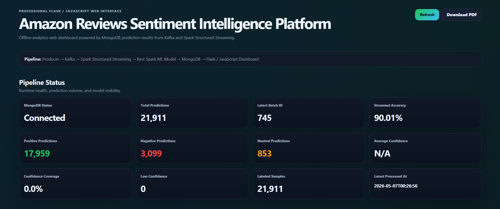
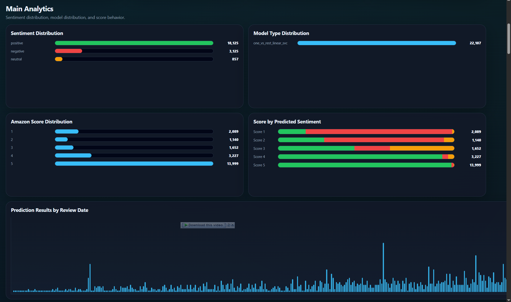
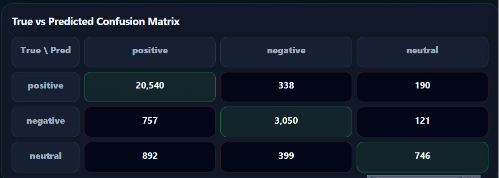
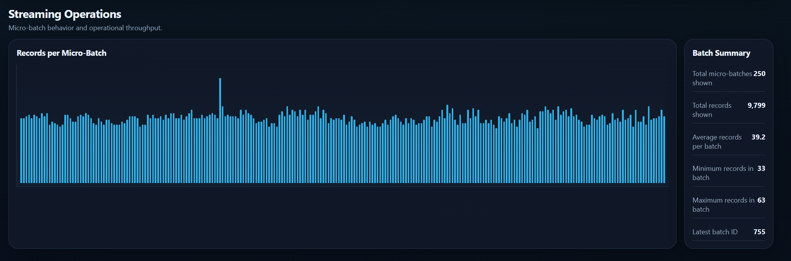
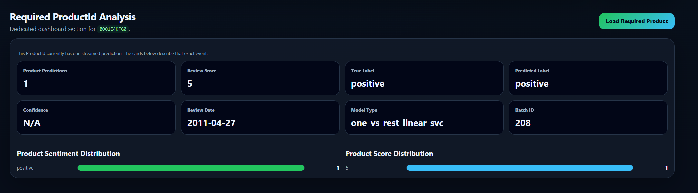
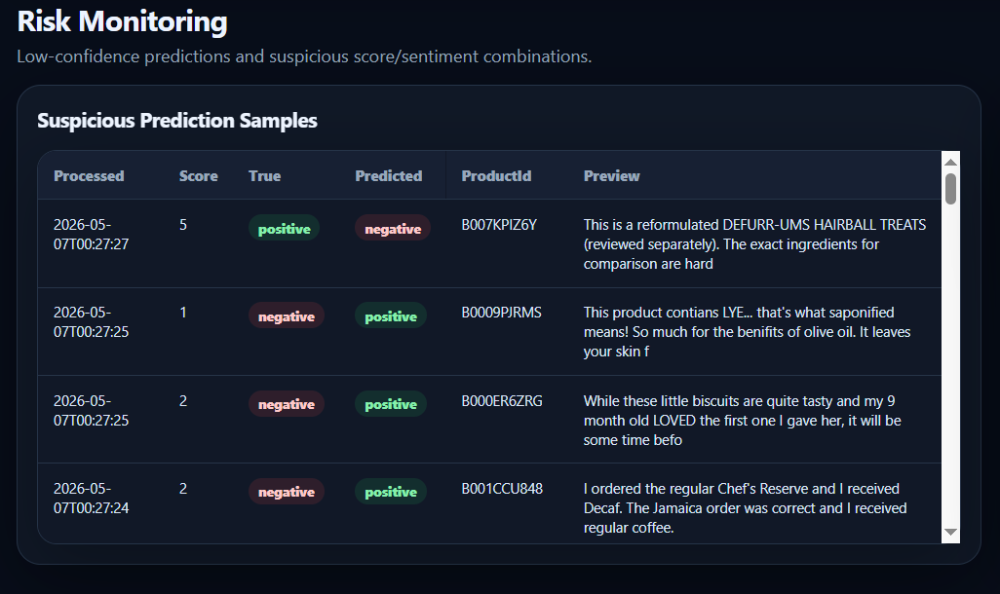
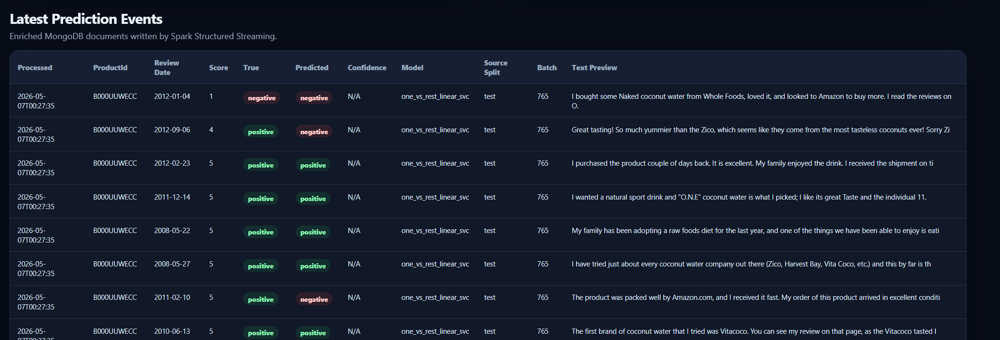
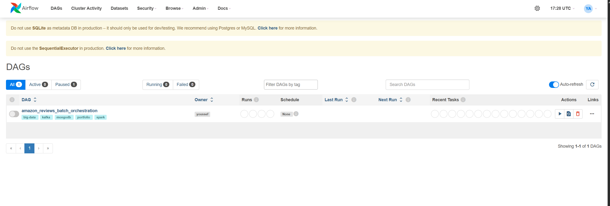
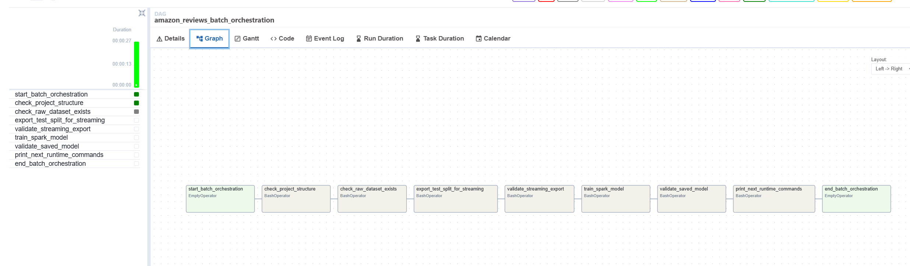
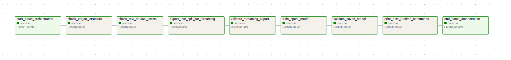

# Amazon Reviews Streaming Sentiment Pipeline


An end-to-end Big Data engineering pipeline that trains and compares multiple Spark ML sentiment classification models on Amazon product reviews, streams prediction events through Kafka and Spark Structured Streaming, persists enriched results in MongoDB, and visualizes pipeline output through a professional Flask/JavaScript web dashboard. The batch preparation and training side is orchestrated with Apache Airflow.

This project is built as a portfolio-grade Big Data system demonstrating a complete engineering workflow: raw data preparation, model training and validation, real-time inference, NoSQL storage, dashboard analytics, orchestration, and project documentation.

---

## Table of Contents

1. [Project Objective](#1-project-objective)
2. [Architecture](#2-architecture)
3. [Technology Stack](#3-technology-stack)
4. [Repository Structure](#4-repository-structure)
5. [Data Source](#5-data-source)
6. [Sentiment Labeling Strategy](#6-sentiment-labeling-strategy)
7. [Feature Engineering Pipeline](#7-feature-engineering-pipeline)
8. [Class Imbalance Handling](#8-class-imbalance-handling)
9. [Model Training and Comparison](#9-model-training-and-comparison)
10. [Model Selection Rationale](#10-model-selection-rationale)
11. [Confidence Reporting](#11-confidence-reporting)
12. [Kafka Streaming Layer](#12-kafka-streaming-layer)
13. [Spark Structured Streaming](#13-spark-structured-streaming)
14. [MongoDB Storage Layer](#14-mongodb-storage-layer)
15. [Flask Web Dashboard](#15-flask-web-dashboard)
16. [Flask API Endpoints](#16-flask-api-endpoints)
17. [Dashboard Features](#17-dashboard-features)
18. [Dashboard Screenshots](#18-dashboard-screenshots)
19. [Apache Airflow Orchestration](#19-apache-airflow-orchestration)
20. [Getting Started](#20-getting-started)
21. [Runtime Commands Reference](#21-runtime-commands-reference)
22. [Example MongoDB Document](#22-example-mongodb-document)
23. [Key Engineering Decisions](#23-key-engineering-decisions)
24. [Future Improvements](#24-future-improvements)

---

## 1. Project Objective

The goal of this project is to build a production-style Big Data pipeline that demonstrates a repeatable data engineering architecture applicable to real-time review classification, customer feedback monitoring, and streaming NLP use cases.

The pipeline covers the full engineering lifecycle:

- Load and prepare Amazon Reviews data using PySpark
- Create a three-class sentiment target from the review score
- Split the dataset into training, validation, and test sets
- Train and compare multiple Spark MLlib models
- Select the best model using validation Macro F1
- Evaluate the selected model on the held-out test set
- Export the test split for online streaming simulation
- Produce review events into Kafka
- Consume events with Spark Structured Streaming
- Apply the selected Spark ML model to incoming reviews
- Persist enriched prediction documents in MongoDB
- Visualize offline analytics from MongoDB through a Flask/JavaScript dashboard
- Orchestrate bounded batch tasks with Apache Airflow

---

## 2. Architecture

```text
Amazon Reviews CSV
        │
        ▼
┌─────────────────────────┐
│  Batch Preprocessing    │  PySpark
│  Clean · Label · Split  │
└──────────┬──────────────┘
           │
           ▼
┌────────────────────────────────────────────┐
│        Spark MLlib Training                │
│                                            │
│  ├── Logistic Regression                   │
│  ├── Naive Bayes                           │
│  ├── One-vs-Rest Linear SVC                │
│  ├── Light Random Forest                   │
│  └── Majority Vote Ensemble                │
└──────────┬─────────────────────────────────┘
           │
           ▼
 Validation-based model selection
           │
           ▼
 Export test split
 data/processed/test_reviews.jsonl
           │
           ▼
┌─────────────────┐
│ Kafka Producer  │
└────────┬────────┘
         │
         ▼
Kafka topic: amazon_reviews
         │
         ▼
┌───────────────────────────────┐
│ Spark Structured Streaming    │
│ Best single streaming model   │
│ one_vs_rest_linear_svc        │
└───────────┬───────────────────┘
            │
            ▼
MongoDB: amazon_reviews_db.sentiment_predictions
            │
            ▼
┌──────────────────────────────┐
│ Flask / JavaScript Dashboard │
│ Offline analytics from DB    │
└──────────────────────────────┘

Apache Airflow orchestrates the bounded batch side:
checks → export → validation → training → model validation.
```

---

## 3. Technology Stack

| Layer | Technology |
|---|---|
| Language | Python 3.10+ |
| Distributed Processing | Apache Spark / PySpark |
| Machine Learning | Spark MLlib |
| Streaming Broker | Apache Kafka |
| Kafka Coordination | Zookeeper |
| Stream Processing | Spark Structured Streaming |
| Storage | MongoDB |
| Web Dashboard | Flask, HTML, CSS, JavaScript |
| Orchestration | Apache Airflow |
| Containerization | Docker / Docker Compose |
| Version Control | Git / GitHub |
| Runtime Environment | WSL / Linux |

---

## 4. Repository Structure

```text
.
├── README.md
├── requirements.txt
├── project_context.md
├── structure.txt
├── useful_commands.txt
│
├── airflow/
│   ├── README_AIRFLOW.md
│   ├── requirements-airflow.txt
│   ├── airflow_home/
│   ├── dags/
│   │   └── amazon_reviews_batch_pipeline.py
│   └── scripts/
│       ├── setup_airflow.sh
│       ├── start_airflow.sh
│       ├── stop_airflow.sh
│       └── test_dag.sh
│
├── data/
│   ├── raw/
│   │   └── Reviews.csv
│   └── processed/
│       ├── checkpoints/
│       ├── test_reviews.csv
│       ├── test_reviews.jsonl
│       ├── test_reviews_stream/
│       └── test_reviews_stream_json/
│
├── docs/
│   ├── PHASE5.md
│   ├── spark_sentiment_tuning_report.md
│   ├── amazon_reviews_sentiment_report_2026-05-02_18-56-28.pdf
│   └── screenshots/
│       ├── 02_docker_services_running.png
│       ├── 03_full_training_metrics.png
│       ├── 04_spark_streaming_to_mongodb.png
│       ├── 05_producer_streaming_reviews.png
│       ├── 06_mongodb_latest_predictions.png
│       ├── 19_airflow_login_page.png
│       ├── 20_airflow_dag_list_detected.png
│       ├── 21_airflow_dag_graph_view.png
│       ├── 22_airflow_dag_run_progress.png
│       ├── 23_airflow_dag_success_run.png
│       ├── flask_dashboard_overview.png
│       ├── flask_latest_prediction_events.png
│       ├── flask_main_analytics_and_review_date.png
│       ├── flask_model_quality.png
│       ├── flask_required_product_analysis.png
│       ├── flask_risk_monitoring.png
│       └── flask_streaming_operations.png
│
├── exports/
│   └── mongodb/
│
├── kafka/
│   ├── docker-compose.yml
│   └── topics.md
│
├── results/
│   ├── final_full_data_metrics.txt
│   ├── model_comparison_results.csv
│   ├── model_comparison_results.md
│   ├── spark_sa_tuning_results.csv
│   └── spark_sa_tuning_results.md
│
├── scripts/
│   └── run_web_dashboard.sh
│
└── src/
    ├── __init__.py
    │
    ├── dashboard/
    │   └── app.py
    │
    ├── experiments/
    │   ├── preprocessing/
    │   └── training/
    │
    ├── ingestion/
    │   ├── __init__.py
    │   └── producer.py
    │
    ├── spark/
    │   ├── model/
    │   ├── models/
    │   ├── streaming/
    │   │   ├── __init__.py
    │   │   ├── consumer.py
    │   │   └── predict_stream.py
    │   └── training/
    │       ├── __init__.py
    │       ├── export_test_split_for_streaming.py
    │       ├── train_spark_pipeline.py
    │       ├── tune_spark_pipeline_sa.py
    │       ├── compare_spark_models.py
    │       ├── train_ensemble_models.py
    │       └── models/
    │           ├── logistic_regression_model.py
    │           ├── naive_bayes_model.py
    │           ├── linear_svc_ovr_model.py
    │           ├── random_forest_model.py
    │           └── majority_vote_ensemble.py
    │
    ├── storage/
    │   ├── __init__.py
    │   ├── mongodb_writer.py
    │   └── test_mongodb_connection.py
    │
    └── web/
        ├── README_WEB.md
        ├── __init__.py
        ├── app.py
        ├── requirements-web.txt
        ├── static/
        │   ├── css/
        │   └── js/
        └── templates/
```

The raw dataset and generated runtime artifacts are intentionally kept out of normal Git tracking to keep the repository lightweight.

---

## 5. Data Source

The project uses the Amazon Fine Food Reviews dataset from Kaggle.

Local expected path:

```text
data/raw/Reviews.csv
```

The dataset contains Amazon food product reviews with the following important fields:

| Column | Role in Project |
|---|---|
| `ProductId` | Product-level dashboard filtering and required product analysis |
| `UserId` | Review metadata |
| `Score` | Source for creating the sentiment label |
| `Time` | Converted into review timestamp/date |
| `Summary` | Short review headline |
| `Text` | Main text used for sentiment prediction |

The raw CSV is not committed to Git because it is a large external dataset.

---

## 6. Sentiment Labeling Strategy

The numeric Amazon score is transformed into a three-class sentiment target:

| Score | Label |
|---|---|
| 1 or 2 | `negative` |
| 3 | `neutral` |
| 4 or 5 | `positive` |

This rule is used consistently across batch training, validation, testing, streaming simulation, MongoDB storage, and dashboard analytics.

---

## 7. Feature Engineering Pipeline

The Spark ML feature engineering pipeline converts raw text reviews into numerical features.

### Tokenization

`RegexTokenizer` splits the review text into lowercase words and removes punctuation patterns.

```text
"This coffee tastes great!" → ["this", "coffee", "tastes", "great"]
```

### Stop Word Removal

`StopWordsRemover` removes common low-signal English words such as `the`, `is`, `and`, and `to`.

### CountVectorizer

`CountVectorizer` learns a vocabulary from the training split and converts tokenized reviews into sparse term-frequency vectors.

Important parameters:

| Parameter | Meaning |
|---|---|
| `vocabSize` | Maximum number of vocabulary terms |
| `minDF` | Minimum number of documents a term must appear in |

### IDF

`IDF` converts raw term-frequency vectors into TF-IDF vectors by down-weighting very common terms and up-weighting more discriminative terms.

### Label Indexing

`StringIndexer` converts the text label into a numerical label index required by Spark ML models.

Observed mapping in the running system:

```text
0.0 → positive
1.0 → negative
2.0 → neutral
```

---

## 8. Class Imbalance Handling

The Amazon Reviews dataset is heavily skewed toward positive reviews. To reduce majority-class dominance, the training pipeline computes class weights from the training distribution.

Example class weights from a full run:

| Class | Weight |
|---|---:|
| `positive` | 0.4287 |
| `neutral` | 4.4364 |
| `negative` | 2.2639 |

The minority classes receive larger weights so their errors matter more during model optimization.

---

## 9. Model Training and Comparison

The project includes both a tuned Logistic Regression baseline and a separate multi-model comparison workflow.

### Main comparison script

```text
src/spark/training/compare_spark_models.py
```

This script trains and compares candidate models on the same train/validation/test split.

### Candidate models

| Model | File |
|---|---|
| Logistic Regression | `src/spark/training/models/logistic_regression_model.py` |
| Naive Bayes | `src/spark/training/models/naive_bayes_model.py` |
| One-vs-Rest Linear SVC | `src/spark/training/models/linear_svc_ovr_model.py` |
| Light Random Forest | `src/spark/training/models/random_forest_model.py` |
| Majority Vote Ensemble | `src/spark/training/models/majority_vote_ensemble.py` |

### Selection rule

All candidate models are trained on the training split and compared on the validation split using Macro F1. The test set is used only once for the final selected model.

### Metrics tracked

| Metric | Why it matters |
|---|---|
| Accuracy | Overall correctness |
| Macro F1 | Balanced comparison across all classes |
| Positive F1 | Performance on dominant positive reviews |
| Negative F1 | Performance on negative reviews |
| Neutral F1 | Performance on the hardest and smallest class |

### Results files

```text
results/model_comparison_results.csv
results/model_comparison_results.md
```

### Model comparison command

```bash
spark-submit src/spark/training/compare_spark_models.py
```

### Legacy tuned Logistic Regression command

```bash
spark-submit src/spark/training/train_spark_pipeline.py
```

For cleaner output:

```bash
spark-submit src/spark/training/train_spark_pipeline.py 2>/dev/null \
  | grep -E "==========|Accuracy|Macro F1|Positive F1|Negative F1|Neutral F1|Model saved"
```

---

## 10. Model Selection Rationale

The comparison results showed that the batch Majority Vote Ensemble achieved the best validation Macro F1.

### Validation ranking

| Rank | Model | Accuracy | Macro F1 | Positive F1 | Negative F1 | Neutral F1 |
|---:|---|---:|---:|---:|---:|---:|
| 1 | `majority_vote_ensemble` | 0.8563 | 0.6997 | 0.9241 | 0.7304 | 0.4446 |
| 2 | `one_vs_rest_linear_svc` | 0.8818 | 0.6925 | 0.9387 | 0.7302 | 0.4088 |
| 3 | `logistic_regression` | 0.8111 | 0.6718 | 0.8948 | 0.7002 | 0.4204 |
| 4 | `naive_bayes` | 0.7759 | 0.6210 | 0.8778 | 0.6327 | 0.3525 |
| 5 | `random_forest_light` | 0.7818 | 0.2956 | 0.8774 | 0.0094 | 0.0000 |

### Final test metrics for selected batch model

| Metric | Value |
|---|---:|
| Accuracy | 0.8573 |
| Macro F1 | 0.7010 |
| Positive F1 | 0.9253 |
| Negative F1 | 0.7308 |
| Neutral F1 | 0.4469 |

### Streaming deployment decision

The best batch model is the `majority_vote_ensemble`, but it is not a single saveable Spark `PipelineModel`. For streaming, the system uses the best practical single model:

```text
one_vs_rest_linear_svc
```

This model is easier to load inside a long-running Spark Structured Streaming job and avoids loading multiple models for every streaming run.

---

## 11. Confidence Reporting

`one_vs_rest_linear_svc` does not expose calibrated probability vectors by default. Because of that, streaming documents produced by this model use:

```json
{
  "probability": [],
  "confidence": null,
  "confidence_status": "not_available",
  "confidence_available": false
}
```

The dashboard does not fabricate confidence values. It displays:

```text
Average Confidence: N/A
Confidence Coverage: 0.0%
```

This is intentional and honest: confidence analytics are available only for models that output probability vectors, such as Logistic Regression or Naive Bayes.

---

## 12. Kafka Streaming Layer

Kafka acts as the streaming message broker between the producer and Spark Structured Streaming.

| Component | Role |
|---|---|
| `kafka/docker-compose.yml` | Starts Kafka, Zookeeper, and MongoDB |
| Kafka topic | `amazon_reviews` |
| `src/ingestion/producer.py` | Reads exported test reviews and sends events to Kafka |

The producer reads from:

```text
data/processed/test_reviews.jsonl
```

Each Kafka message contains:

| Field | Description |
|---|---|
| `product_id` | Amazon product identifier |
| `user_id` | Reviewer identifier |
| `review_time` | Formatted review timestamp |
| `review_date` | Review date used for dashboard charts |
| `score` | Original Amazon score |
| `summary` | Review headline |
| `text` | Full review text |
| `label` | Ground-truth sentiment label |
| `source_split` | `test` or `product_demo` |
| `source_row_index` | Source row index from exported data |

The export also includes the required product demo row for:

```text
ProductId = B001E4KFG0
```

This guarantees that the dashboard can show the required product-level analysis section even if that product does not naturally appear in the random test split.

---

## 13. Spark Structured Streaming

The streaming prediction job is implemented in:

```text
src/spark/streaming/predict_stream.py
```

It performs the following continuous pipeline:

```text
Read Kafka topic amazon_reviews
        │
        ▼
Parse JSON messages
        │
        ▼
Apply saved Spark ML model
        │
        ▼
Decode predicted label
        │
        ▼
Enrich with metadata
        │
        ▼
Write prediction documents to MongoDB
```

Spark Structured Streaming works in micro-batches. This is still streaming because the job stays active, continuously polls Kafka, tracks offsets, and writes new predictions as soon as new records arrive.

Example runtime output:

```text
LOADING BEST SINGLE SPARK MODEL
Model name: one_vs_rest_linear_svc
READING FROM KAFKA
STREAMING BEST SINGLE MODEL PREDICTIONS TO MONGODB STARTED
Batch 207: inserted 45 documents into MongoDB. model_type=['one_vs_rest_linear_svc'] | confidence_available=0/45
Batch 208: inserted 459 documents into MongoDB. model_type=['one_vs_rest_linear_svc'] | confidence_available=0/459
```

---

## 14. MongoDB Storage Layer

MongoDB stores the prediction results written by Spark Structured Streaming.

| Item | Value |
|---|---|
| Database | `amazon_reviews_db` |
| Collection | `sentiment_predictions` |
| Writer | `src/storage/mongodb_writer.py` |

Each document stores both the prediction result and the metadata required for dashboard filtering.

Main fields:

| Field | Description |
|---|---|
| `schema_version` | Document schema version |
| `product_id` | Product identifier |
| `user_id` | Reviewer identifier |
| `review_time` | Review timestamp |
| `review_date` | Review date |
| `score` | Original review score |
| `summary` | Review summary |
| `text_preview` | Short text preview |
| `text` | Full review text |
| `true_label` | Ground-truth label |
| `prediction` | Numeric prediction |
| `predicted_label` | Decoded prediction |
| `model_type` | Model identifier |
| `model_name` | Model display name |
| `probability` | Probability vector if available |
| `confidence` | Max probability if available |
| `confidence_status` | `available` or `not_available` |
| `confidence_available` | Boolean indicator |
| `source_split` | `test` or `product_demo` |
| `source_row_index` | Source row index |
| `batch_id` | Spark micro-batch ID |
| `processed_at` | MongoDB insert timestamp |
| `source` | `spark_structured_streaming` |

---

## 15. Flask Web Dashboard

The final dashboard is implemented with Flask, HTML, CSS, and JavaScript.

| File | Purpose |
|---|---|
| `src/web/app.py` | Flask backend and API routes |
| `src/web/templates/dashboard.html` | Main dashboard page |
| `src/web/static/css/` | Dashboard styling |
| `src/web/static/js/` | Dashboard interactivity and chart rendering |
| `scripts/run_web_dashboard.sh` | Helper script to launch the dashboard |

The Flask dashboard replaced the earlier Streamlit prototype because the project requirements mention Django/Flask/JavaScript for the web interface and because Flask gives more control over layout, API design, report export, and professional dashboard behavior.

---

## 16. Flask API Endpoints

| Endpoint | Method | Description |
|---|---|---|
| `/` | GET | Main dashboard page |
| `/api/health` | GET | MongoDB connection status |
| `/api/summary` | GET | KPI cards and global status |
| `/api/charts` | GET | Chart datasets |
| `/api/risk` | GET | Suspicious predictions and low-confidence samples |
| `/api/latest` | GET | Latest prediction events |
| `/api/options` | GET | Filter options |
| `/api/product/<product_id>` | GET | Product-level analysis |
| `/api/report.pdf` | GET | Downloadable PDF report |

---

## 17. Dashboard Features

### Pipeline Status

The dashboard shows:

- MongoDB connection status
- Total predictions
- Latest batch ID
- Streamed accuracy
- Positive, negative, and neutral prediction counts
- Average confidence when available
- Confidence coverage
- Low-confidence count
- Latest processed timestamp

### Main Analytics

- Sentiment distribution
- Model type distribution
- Amazon score distribution
- Score by predicted sentiment
- Prediction results by review date

### Model Quality Analytics

- Confidence distribution when available
- Average confidence by sentiment when available
- Average confidence by model when available
- True-label vs predicted-label confusion matrix

For `one_vs_rest_linear_svc`, confidence charts correctly show no data because the model does not output calibrated probabilities.

### Streaming Operations

- Records processed per Spark micro-batch
- Total micro-batches shown
- Total records shown
- Average, minimum, and maximum records per batch
- Latest batch ID

### ProductId Analysis

The dashboard includes the required ProductId section for:

```text
B001E4KFG0
```

It shows:

- Product prediction count
- Latest score
- True label
- Predicted label
- Confidence if available
- Review date
- Model type
- Batch ID
- Product sentiment distribution
- Product score distribution

### Risk Monitoring

Risk monitoring surfaces prediction cases that deserve manual review:

| Risk Type | Definition |
|---|---|
| High-score suspicious prediction | Score ≥ 4 predicted as `negative` |
| Low-score suspicious prediction | Score ≤ 2 predicted as `positive` |
| Neutral mismatch | Extreme scores predicted as `neutral` |
| Low confidence | Confidence below threshold when confidence exists |

### Latest Prediction Events

The dashboard displays recent MongoDB prediction documents with product ID, review date, score, true label, predicted label, model type, source split, batch ID, and text preview.

---

## 18. Dashboard Screenshots

### Flask Dashboard Overview



### Main Analytics and Review Date



### Model Quality Analytics



### Streaming Operations



### Product-Level Analysis



### Risk Monitoring



### Latest Prediction Events



### Airflow DAG Detection



### Airflow DAG Graph



### Airflow Successful DAG Run



---

## 19. Apache Airflow Orchestration

Airflow is used to orchestrate the bounded batch side of the project.

| File | Purpose |
|---|---|
| `airflow/dags/amazon_reviews_batch_pipeline.py` | Main DAG |
| `airflow/scripts/setup_airflow.sh` | Setup script |
| `airflow/scripts/start_airflow.sh` | Start Airflow services |
| `airflow/scripts/stop_airflow.sh` | Stop Airflow services |
| `airflow/scripts/test_dag.sh` | Validate DAG import |
| `airflow/README_AIRFLOW.md` | Airflow documentation |

DAG name:

```text
amazon_reviews_batch_orchestration
```

### DAG sequence

```text
start_batch_orchestration
        │
        ▼
check_project_structure
        │
        ▼
check_raw_dataset_exists
        │
        ▼
export_test_split_for_streaming
        │
        ▼
validate_streaming_export
        │
        ▼
train_spark_model
        │
        ▼
validate_saved_model
        │
        ▼
print_next_runtime_commands
        │
        ▼
end_batch_orchestration
```

### Why Airflow is used only for batch tasks

Airflow is designed for tasks that start, finish, and report success or failure. Kafka, MongoDB, Spark Structured Streaming, and the Flask dashboard are long-running services, so they are launched separately. This separation keeps the architecture clean:

| Component | Responsibility |
|---|---|
| Airflow | Batch preparation and training orchestration |
| Kafka | Continuous event broker |
| Spark Structured Streaming | Continuous prediction processing |
| MongoDB | Persistent storage |
| Flask | Dashboard and reporting interface |

---

## 20. Getting Started

### Prerequisites

- Python 3.10+
- Java 11+
- Apache Spark available on `PATH`
- Docker and Docker Compose
- WSL/Linux environment recommended
- Apache Airflow for orchestration

### Installation

```bash
git clone https://github.com/KYoussefAI/amazon-reviews-streaming-pipeline.git
cd amazon-reviews-streaming-pipeline
python -m venv .venv
source .venv/bin/activate
pip install -r requirements.txt
```

### Dataset setup

Download the Amazon Fine Food Reviews dataset from Kaggle and place the CSV file here:

```text
data/raw/Reviews.csv
```

### Step 1 — Start Kafka, Zookeeper, and MongoDB

```bash
cd kafka
docker compose up -d
docker compose ps
cd ..
```

### Step 2 — Run model comparison

```bash
spark-submit src/spark/training/compare_spark_models.py
```

This generates:

```text
results/model_comparison_results.csv
results/model_comparison_results.md
```

### Step 3 — Export the test split for streaming

```bash
spark-submit src/spark/training/export_test_split_for_streaming.py
```

Expected output:

```text
data/processed/test_reviews.jsonl
```

### Step 4 — Start Spark Structured Streaming

```bash
spark-submit src/spark/streaming/predict_stream.py
```

If the streaming code was changed and an old checkpoint causes a source mismatch, clear the old checkpoint before restarting:

```bash
rm -rf data/processed/checkpoints/spark_streaming_predictions
spark-submit src/spark/streaming/predict_stream.py
```

### Step 5 — Start the Kafka producer in another terminal

```bash
python src/ingestion/producer.py
```

### Step 6 — Start the Flask dashboard in another terminal

```bash
./scripts/run_web_dashboard.sh
```

or:

```bash
python src/web/app.py
```

Open:

```text
http://localhost:5000
```

### Step 7 — Optional Airflow orchestration

```bash
./airflow/scripts/start_airflow.sh
```

Open Airflow, then trigger:

```text
amazon_reviews_batch_orchestration
```

To validate the DAG import:

```bash
./airflow/scripts/test_dag.sh
```

To stop Airflow:

```bash
./airflow/scripts/stop_airflow.sh
```

---

## 21. Runtime Commands Reference

### Project start

```bash
cd "/mnt/c/Users/Me/Desktop/END TO END DATA ENGINEERING PROJECTS/BIG DATA PROJECT"
source .venv/bin/activate
```

### Check Docker services

```bash
cd kafka
docker compose ps
cd ..
```

### Check MongoDB predictions

```bash
docker exec -it mongodb mongosh
```

```javascript
use amazon_reviews_db

db.sentiment_predictions.find(
  {},
  {
    _id: 0,
    product_id: 1,
    review_date: 1,
    score: 1,
    true_label: 1,
    predicted_label: 1,
    model_type: 1,
    confidence: 1,
    confidence_available: 1,
    source_split: 1,
    batch_id: 1,
    processed_at: 1
  }
).sort({ processed_at: -1 }).limit(5).pretty()
```

### Count predictions by model

```javascript
db.sentiment_predictions.aggregate([
  { $group: { _id: "$model_type", count: { $sum: 1 } } },
  { $sort: { count: -1 } }
])
```

### Verify required ProductId

```javascript
db.sentiment_predictions.find(
  { product_id: "B001E4KFG0" },
  {
    _id: 0,
    product_id: 1,
    score: 1,
    true_label: 1,
    predicted_label: 1,
    model_type: 1,
    batch_id: 1,
    source_split: 1
  }
).sort({ processed_at: -1 }).limit(5).pretty()
```

### Tune Logistic Regression hyperparameters

```bash
spark-submit src/spark/training/tune_spark_pipeline_sa.py
```

### Verify Kafka topic

```bash
docker exec -it kafka kafka-topics.sh \
  --bootstrap-server localhost:9092 \
  --list
```

### Airflow DAG check

```bash
./airflow/scripts/test_dag.sh
```

---

## 22. Example MongoDB Document

Example prediction document written by Spark Structured Streaming:

```json
{
  "schema_version": "v2",
  "product_id": "B001E4KFG0",
  "user_id": "A3SGXH7AUHU8GW",
  "review_time": "2011-04-27 01:00:00",
  "review_date": "2011-04-27",
  "score": 5,
  "summary": "Good Quality Dog Food",
  "text_preview": "I have bought several of the Vitality canned dog food products and have found...",
  "true_label": "positive",
  "prediction": 0.0,
  "predicted_label": "positive",
  "model_type": "one_vs_rest_linear_svc",
  "model_name": "one_vs_rest_linear_svc",
  "probability": [],
  "confidence": null,
  "confidence_status": "not_available",
  "confidence_available": false,
  "source_split": "product_demo",
  "batch_id": 208,
  "source": "spark_structured_streaming",
  "processed_at": "ISODate(...)"
}
```

---

## 23. Key Engineering Decisions

### Spark MLlib over scikit-learn

Spark MLlib was used for the production pipeline because it integrates naturally with distributed processing and Spark Structured Streaming.

### Kafka as the streaming broker

Kafka decouples the ingestion layer from the processing layer. The producer can send events independently while Spark consumes them continuously.

### Spark Structured Streaming for online inference

Spark Structured Streaming applies the saved model to new Kafka events in micro-batches. This provides a realistic streaming architecture while reusing the same Spark feature pipeline used during training.

### MongoDB for prediction storage

MongoDB stores flexible prediction documents containing text metadata, product information, model outputs, confidence metadata, and timestamps. This makes it practical for dashboard queries and evolving schema requirements.

### Flask over Streamlit for the final interface

Streamlit was useful for prototyping, but the final project uses Flask/JavaScript to match the project requirement and provide a more professional, controllable web interface.

### Majority Vote Ensemble for batch evaluation

The ensemble achieved the best validation and test Macro F1 by combining multiple model outputs.

### One-vs-Rest Linear SVC for streaming deployment

The single best saveable streaming model is used for online inference because it is easier to load, faster to run, and avoids the complexity of multi-model voting inside a long-running stream.

### Honest confidence handling

The dashboard does not invent confidence scores for models that do not output probabilities. This keeps the system technically honest and avoids misleading interpretation.

---

## 24. Future Improvements

| Improvement | Description |
|---|---|
| Dockerize Flask dashboard | Run the web dashboard as a Docker service |
| Full Docker Compose stack | One command for Kafka, MongoDB, Spark jobs, and Flask |
| Scheduled retraining | Airflow DAG to retrain models periodically |
| Model registry | Track model versions and selected production model |
| REST scoring endpoint | Submit custom review text and return a prediction |
| Prometheus and Grafana | Monitor service health, throughput, and lag |
| Data drift monitoring | Detect changes in review distributions over time |
| CI/CD with GitHub Actions | Run checks automatically on each push |
| Unit and integration tests | Test transformations, model outputs, Kafka messages, and MongoDB writes |
| Cloud deployment | Deploy the architecture on cloud infrastructure |

---

## License

This project is open source and available under the MIT License.
