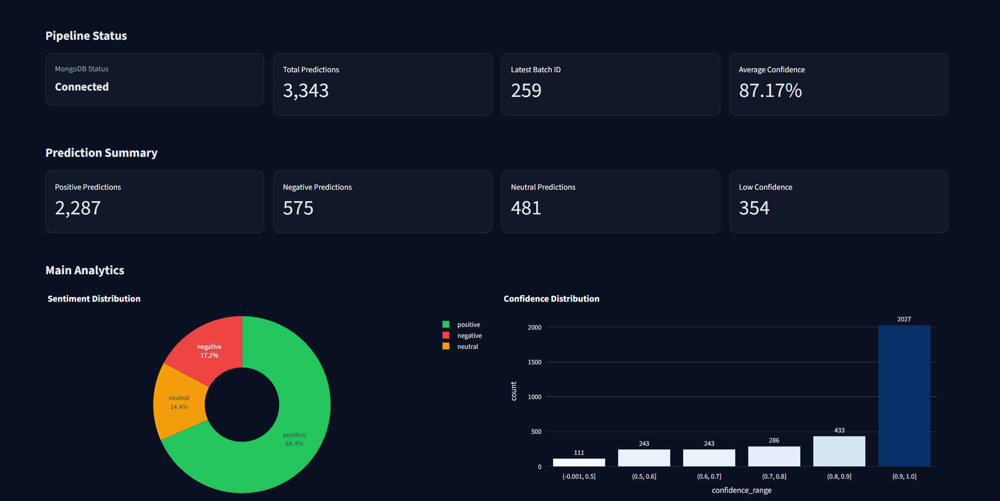
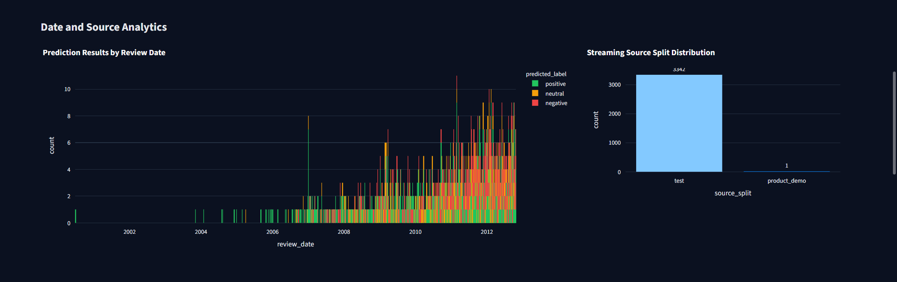
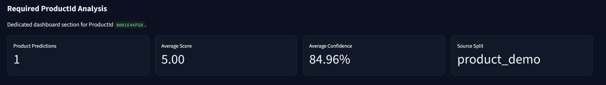
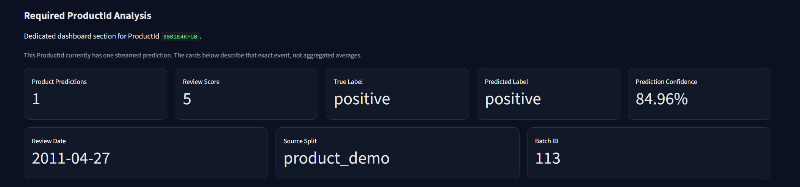
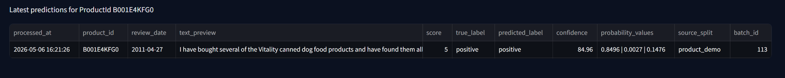
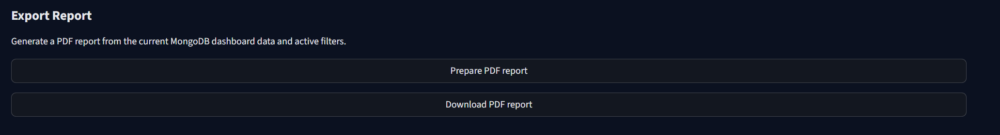
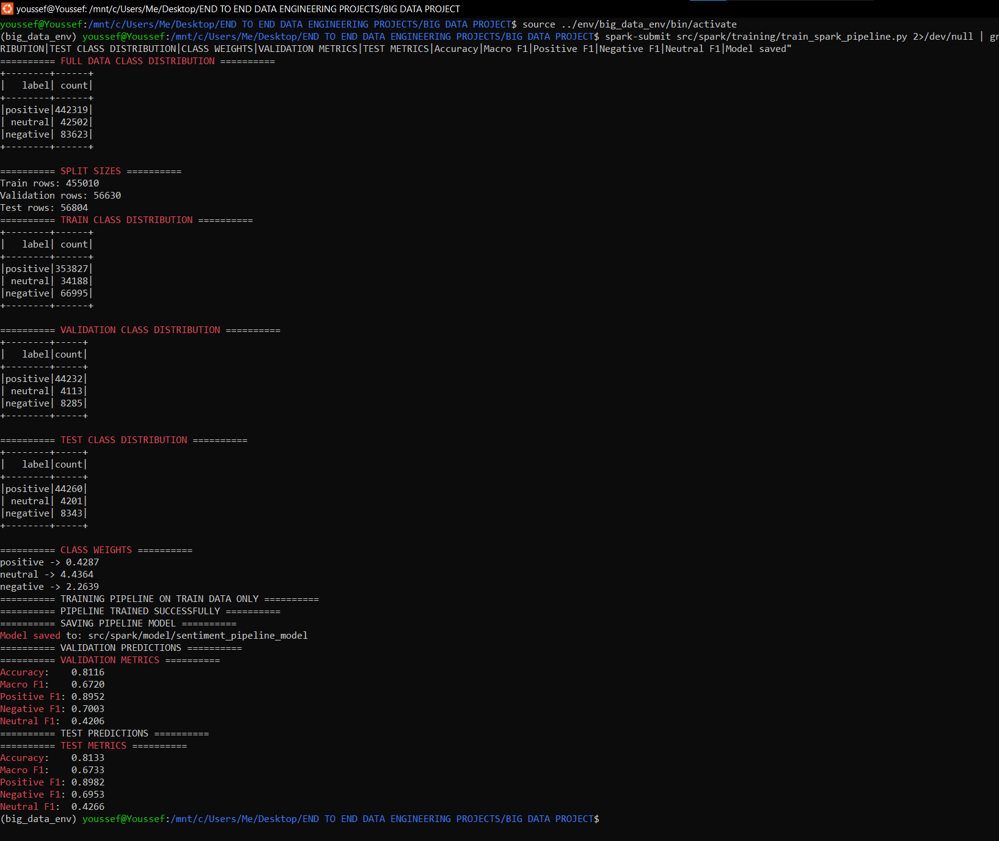
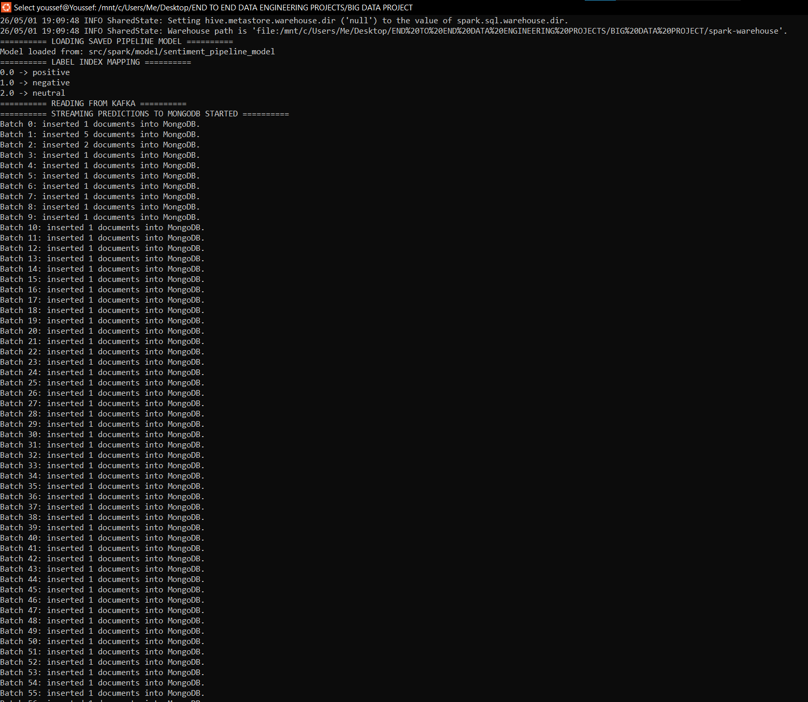

# Amazon Reviews Real-Time Sentiment Command Center

A production-oriented Big Data project that streams Amazon review events through Kafka, applies Spark ML sentiment prediction with Spark Structured Streaming, stores enriched predictions in MongoDB, and visualizes operational analytics in a Streamlit dashboard.

This project was built phase by phase as a practical data engineering training lab: ingestion, streaming, distributed processing, machine learning inference, storage, dashboarding, validation, reporting, and documentation.

---

## Table of Contents

1. [Project Objective](#1-project-objective)
2. [Current Status](#2-current-status)
3. [Architecture](#3-architecture)
4. [Requirement Coverage](#4-requirement-coverage)
5. [Tech Stack](#5-tech-stack)
6. [Dataset](#6-dataset)
7. [Repository Structure](#7-repository-structure)
8. [Completed Phases](#8-completed-phases)
9. [Spark ML Training Pipeline](#9-spark-ml-training-pipeline)
10. [Final Model Metrics](#10-final-model-metrics)
11. [Streaming Export Layer](#11-streaming-export-layer)
12. [Kafka Producer](#12-kafka-producer)
13. [Spark Structured Streaming Inference](#13-spark-structured-streaming-inference)
14. [MongoDB Storage](#14-mongodb-storage)
15. [Streamlit Dashboard](#15-streamlit-dashboard)
16. [PDF Report Export](#16-pdf-report-export)
17. [Screenshots](#17-screenshots)
18. [How to Run](#18-how-to-run)
19. [MongoDB Validation Commands](#19-mongodb-validation-commands)
20. [Git and Artifact Rules](#20-git-and-artifact-rules)
21. [Future Improvements](#21-future-improvements)
22. [Portfolio Summary](#22-portfolio-summary)

---

## 1. Project Objective

The objective is to build a complete real-time Big Data sentiment analysis pipeline for Amazon product reviews.

```text
Amazon Reviews CSV
→ Streaming test export
→ Kafka Producer
→ Kafka topic
→ Spark Structured Streaming
→ Saved Spark ML model
→ MongoDB
→ Streamlit dashboard
→ PDF report
```

The project simulates a real data engineering workflow where review events are ingested continuously, processed by a distributed streaming engine, enriched with machine learning predictions, stored in a NoSQL database, and monitored through an analytics dashboard.

---

## 2. Current Status

Current completed architecture:

```text
Producer
→ Kafka
→ Spark Structured Streaming
→ Spark ML Prediction
→ MongoDB
→ Streamlit Dashboard
→ PDF Report
```

Completed:

- Kafka and Zookeeper running with Docker Compose.
- MongoDB running as a Docker service.
- Test split exported for online prediction simulation.
- Kafka producer streaming enriched Amazon review events.
- Spark-only ML training pipeline.
- TF-IDF feature engineering using unigrams and bigrams.
- Class-weighted Logistic Regression for imbalanced sentiment classes.
- Simulated Annealing hyperparameter tuning.
- Final Spark `PipelineModel` saved locally.
- Spark Structured Streaming inference from Kafka.
- Enriched prediction documents written to MongoDB.
- ProductId, UserId, review date, score, true label, prediction, probability, batch ID, and source split preserved end-to-end.
- Streamlit dashboard connected to MongoDB.
- Dashboard KPIs, charts, filters, live refresh, confidence analytics, risk monitoring, latest events table, ProductId analysis, prediction-by-date analytics, and PDF report export.
- Requirement ProductId `B001E4KFG0` handled in the dashboard.

Final clean dashboard run observed:

| Metric | Value |
|---|---:|
| Total predictions | 56,813 |
| Latest batch ID | 7,146 |
| Average confidence | 87.08% |
| Positive predictions | 38,899 |
| Negative predictions | 9,746 |
| Neutral predictions | 8,168 |

---

## 3. Architecture

### 3.1 High-Level Architecture

```text
                ┌─────────────────────────┐
                │  Amazon Reviews CSV     │
                │  data/raw/Reviews.csv   │
                └───────────┬─────────────┘
                            │
                            ▼
                ┌─────────────────────────┐
                │ Test Split Export       │
                │ export_test_split_...py │
                └───────────┬─────────────┘
                            │ JSONL test events
                            ▼
                ┌─────────────────────────┐
                │ Kafka Producer          │
                │ src/ingestion/producer.py
                └───────────┬─────────────┘
                            │ JSON messages
                            ▼
                ┌─────────────────────────┐
                │ Kafka Topic             │
                │ amazon_reviews          │
                └───────────┬─────────────┘
                            │ streaming read
                            ▼
                ┌─────────────────────────┐
                │ Spark Structured        │
                │ Streaming               │
                └───────────┬─────────────┘
                            │
                            ▼
                ┌─────────────────────────┐
                │ Spark ML PipelineModel  │
                │ TF-IDF + Logistic Reg.  │
                └───────────┬─────────────┘
                            │ predictions
                            ▼
                ┌─────────────────────────┐
                │ MongoDB                 │
                │ sentiment_predictions   │
                └───────────┬─────────────┘
                            │ query
                            ▼
                ┌─────────────────────────┐
                │ Streamlit Dashboard     │
                │ Command Center          │
                └─────────────────────────┘
```

### 3.2 Runtime Data Flow

```text
data/processed/test_reviews.jsonl
→ producer.py
→ Kafka topic: amazon_reviews
→ predict_stream.py
→ saved Spark PipelineModel
→ mongodb_writer.py
→ amazon_reviews_db.sentiment_predictions
→ dashboard/app.py
```

### 3.3 Why the Streaming Export Layer Exists

The project requirement uses the 10% reserved test data for online prediction simulation. Instead of streaming the raw `Reviews.csv` directly, the project first prepares a clean JSONL file containing the test reviews and required metadata.

This keeps responsibilities clean:

| Layer | Responsibility |
|---|---|
| Export script | Prepare clean test events |
| Producer | Send prepared events to Kafka |
| Spark Streaming | Predict sentiment in real time |
| MongoDB writer | Store prediction history |
| Dashboard | Analyze stored prediction results |

---

## 4. Requirement Coverage

The project PDF asks for:

| Requirement | Implemented? | Project implementation |
|---|---:|---|
| Real-time review exploration with Kafka | Yes | `producer.py` sends review events to Kafka topic `amazon_reviews` |
| Data preparation, vectorization, TF-IDF | Yes | Spark ML pipeline uses RegexTokenizer, StopWordsRemover, CountVectorizer, IDF |
| Dataset partitioning and label creation | Yes | 80% train, 10% validation, 10% test; score-based sentiment label |
| Training on 80% of data | Yes | `train_spark_pipeline.py` |
| Validation and hyperparameter tuning on 10% | Yes | Validation metrics + Simulated Annealing tuner |
| Final testing on 10% | Yes | Final test metrics reported |
| Choose and save best model | Yes | Best Spark `PipelineModel` saved locally |
| Online prediction using 10% test data | Yes | Exported test split streamed through Kafka |
| Offline dashboard from MongoDB predictions | Yes | Streamlit dashboard reads MongoDB predictions |
| Prediction results by date | Yes | Dashboard section `Prediction Results by Review Date` |
| ProductId `B001E4KFG0` scoring | Yes | Dedicated dashboard section `Required ProductId Analysis` |
| GitHub upload | Yes | Repository prepared for GitHub |

Important note: the current dashboard implementation uses Streamlit + Plotly. The project PDF mentions Django / Flask / JavaScript for web deployment. Streamlit was used as the implemented analytics dashboard for this version. A Flask or Django web layer is listed as a future improvement, not as a completed feature.

---

## 5. Tech Stack

| Layer | Tool |
|---|---|
| Programming | Python |
| Message Broker | Apache Kafka |
| Kafka Coordination | Zookeeper |
| Containerized Services | Docker Compose |
| Streaming Processing | Apache Spark Structured Streaming |
| Machine Learning | Spark MLlib |
| Feature Engineering | RegexTokenizer, StopWordsRemover, CountVectorizer, IDF, NGram, VectorAssembler |
| Model | Class-weighted Logistic Regression |
| Storage | MongoDB |
| Dashboard | Streamlit + Plotly |
| Reporting | ReportLab PDF export |
| Environment | WSL/Linux recommended |
| Version Control | Git + GitHub |

---

## 6. Dataset

Dataset:

```text
Amazon Fine Food Reviews
```

Expected local path:

```text
data/raw/Reviews.csv
```

Main fields used:

| Original column | Normalized field | Role |
|---|---|---|
| `ProductId` | `product_id` | Product-level dashboard analysis |
| `UserId` | `user_id` | Review metadata |
| `Time` | `review_time`, `review_date` | Time/date analytics |
| `Score` | `score` | Original Amazon rating |
| `Summary` | `summary` | Short review summary |
| `Text` | `text` | Review text used for prediction |

Sentiment labeling rule:

| Score condition | Sentiment label |
|---|---|
| `Score < 3` | `negative` |
| `Score == 3` | `neutral` |
| `Score > 3` | `positive` |

The raw CSV is not committed to Git because it is large.

---

## 7. Repository Structure

Current professional structure:

```text
BIG DATA PROJECT/
│
├── docs/
│   ├── PHASE5.md
│   ├── spark_sentiment_tuning_report.md
│   └── screenshots/
│       ├── 01_project_structure.png
│       ├── 02_docker_services_running.png
│       ├── 03_full_training_metrics.png
│       ├── 04_spark_streaming_to_mongodb.png
│       ├── 05_producer_streaming_reviews.png
│       ├── 06_mongodb_latest_predictions.png
│       ├── 13_dashboard_overview_kpis.png
│       ├── 14_dashboard_prediction_results_by_date.png
│       ├── 15_dashboard_productid_filter.png
│       ├── 16_dashboard_productid_b001e4kfg0_analysis.png
│       ├── 17_dashboard_enriched_latest_events.png
│       └── 18_dashboard_pdf_report_export.png
│
├── kafka/
│   ├── docker-compose.yml
│   └── topics.md
│
├── results/
│   ├── spark_sa_tuning_results.csv
│   └── spark_sa_tuning_results.md
│
├── src/
│   ├── __init__.py
│   │
│   ├── dashboard/
│   │   └── app.py
│   │
│   ├── experiments/
│   │   ├── preprocessing/
│   │   │   ├── __init__.py
│   │   │   ├── clean.py
│   │   │   ├── dataset.py
│   │   │   ├── label.py
│   │   │   ├── resampling.py
│   │   │   └── vectorizer.py
│   │   └── training/
│   │       ├── __init__.py
│   │       └── train.py
│   │
│   ├── ingestion/
│   │   ├── __init__.py
│   │   └── producer.py
│   │
│   ├── spark/
│   │   ├── training/
│   │   │   ├── __init__.py
│   │   │   ├── train_spark_pipeline.py
│   │   │   ├── tune_spark_pipeline_sa.py
│   │   │   └── export_test_split_for_streaming.py
│   │   │
│   │   ├── streaming/
│   │   │   ├── __init__.py
│   │   │   ├── consumer.py
│   │   │   └── predict_stream.py
│   │   │
│   │   └── model/
│   │       └── sentiment_pipeline_model/
│   │
│   └── storage/
│       ├── __init__.py
│       ├── mongodb_writer.py
│       └── test_mongodb_connection.py
│
├── data/
│   ├── raw/
│   │   └── Reviews.csv
│   └── processed/
│       └── test_reviews.jsonl
│
├── exports/
│   └── reports/
│
├── backups/
│   └── mongodb/
│
├── project_context.md
├── README.md
├── requirements.txt
├── structure.txt
├── useful_commands.txt
└── .gitignore
```

Local-only generated artifacts:

```text
data/raw/
data/processed/
src/spark/model/
src/spark/models/
spark-warehouse/
metastore_db/
exports/
backups/
.venv/
venv/
env/
big_data_env/
__pycache__/
```

---

## 8. Completed Phases

| Phase | Status | Output |
|---|---:|---|
| Phase 1 | Completed | Kafka + Zookeeper + basic producer/consumer |
| Phase 2 | Completed | Text cleaning and TF-IDF experimentation |
| Phase 3 | Completed | Dataset creation and train/validation/test split |
| Phase 4 | Completed | Initial Spark Logistic Regression model |
| Phase 5 | Completed | Validation metrics and imbalance analysis |
| Phase 6 | Completed | Final test evaluation |
| Phase 7 | Completed | Model selection and saved Spark model |
| Phase 8 | Completed | Spark Structured Streaming inference from Kafka |
| Phase 9 | Completed | MongoDB storage with `foreachBatch` |
| Phase 10 | Completed | Streamlit dashboard from MongoDB |
| Phase 11 | Completed | PDF report export |
| Phase 12 | Completed | ProductId/date metadata preserved end-to-end and dashboard requirement compliance |

---

## 9. Spark ML Training Pipeline

Production training file:

```text
src/spark/training/train_spark_pipeline.py
```

Spark ML pipeline:

```text
text
→ RegexTokenizer
→ StopWordsRemover
→ NGram
→ CountVectorizer for unigrams
→ IDF for unigrams
→ CountVectorizer for bigrams
→ IDF for bigrams
→ VectorAssembler
→ StringIndexer
→ Class-weighted Logistic Regression
```

Final selected hyperparameters:

```python
vocab_size = 10000
min_df = 4
max_iter = 15
reg_param = 0.000025
use_bigrams = True
```

Saved model path:

```text
src/spark/model/sentiment_pipeline_model
```

The model folder is generated locally and should not be committed.

---

## 10. Final Model Metrics

The final full-data training run used valid Amazon review rows after cleaning and filtering.

### Full Dataset Class Distribution

| Label | Count |
|---|---:|
| positive | 442,319 |
| negative | 83,623 |
| neutral | 42,502 |

Total rows:

```text
568,444
```

### Split Sizes

| Split | Rows |
|---|---:|
| Train | 455,010 |
| Validation | 56,630 |
| Test | 56,804 |

### Class Weights

| Label | Weight |
|---|---:|
| positive | 0.4287 |
| negative | 2.2639 |
| neutral | 4.4364 |

### Validation Metrics

| Metric | Value |
|---|---:|
| Accuracy | 0.8116 |
| Macro F1 | 0.6720 |
| Positive F1 | 0.8952 |
| Negative F1 | 0.7003 |
| Neutral F1 | 0.4206 |

### Test Metrics

| Metric | Value |
|---|---:|
| Accuracy | 0.8133 |
| Macro F1 | 0.6733 |
| Positive F1 | 0.8982 |
| Negative F1 | 0.6953 |
| Neutral F1 | 0.4266 |

Validation and test metrics are close, so the model generalizes reasonably well for a first production baseline.

---

## 11. Streaming Export Layer

Streaming export file:

```text
src/spark/training/export_test_split_for_streaming.py
```

Output file:

```text
data/processed/test_reviews.jsonl
```

Role:

```text
Reviews.csv
→ clean valid rows
→ create label
→ convert Unix Time into review_time and review_date
→ use the same split function as training
→ export the 10% test split
→ ensure ProductId B001E4KFG0 is available for dashboard requirement analysis
```

Exported event schema:

| Field | Meaning |
|---|---|
| `product_id` | Product identifier |
| `user_id` | User identifier |
| `review_time` | Review timestamp as readable string |
| `review_date` | Review date for dashboard time analytics |
| `score` | Original Amazon score |
| `summary` | Review summary |
| `text` | Full review text |
| `label` | True sentiment label from score |
| `source_split` | `test` or `product_demo` |

The `product_demo` marker is used only when adding the required ProductId sample for `B001E4KFG0`. This keeps the dataset transparent and avoids silently mixing requirement-specific rows with the regular test split.

---

## 12. Kafka Producer

Producer file:

```text
src/ingestion/producer.py
```

Input:

```text
data/processed/test_reviews.jsonl
```

Kafka topic:

```text
amazon_reviews
```

Kafka message schema:

| Field | Meaning |
|---|---|
| `product_id` | Product ID preserved from Amazon dataset |
| `user_id` | User ID preserved from Amazon dataset |
| `review_time` | Review timestamp |
| `review_date` | Review date |
| `score` | Original Amazon score |
| `summary` | Review summary |
| `text` | Review text |
| `label` | True label |
| `source_split` | Origin marker |
| `source_row_index` | Row index in exported stream file |

The producer does not train or transform features. It only sends prepared review events to Kafka.

---

## 13. Spark Structured Streaming Inference

Streaming prediction file:

```text
src/spark/streaming/predict_stream.py
```

The streaming job:

1. Starts a Spark session.
2. Loads the saved Spark `PipelineModel`.
3. Reads JSON messages from Kafka topic `amazon_reviews`.
4. Parses incoming review metadata.
5. Adds schema-compatible columns needed by the saved pipeline.
6. Applies the Spark ML model to the review text.
7. Converts numeric predictions into readable sentiment labels.
8. Sends enriched predictions to MongoDB using `foreachBatch`.

Current label mapping:

```text
0.0 → positive
1.0 → negative
2.0 → neutral
```

Important inference principle:

```text
The streaming job does not train.
It only loads the saved model and predicts incoming events.
```

---

## 14. MongoDB Storage

MongoDB target:

```text
URI: mongodb://localhost:27017
Database: amazon_reviews_db
Collection: sentiment_predictions
```

Storage writer:

```text
src/storage/mongodb_writer.py
```

Spark writes predictions using:

```python
foreachBatch(write_predictions_to_mongodb)
```

Each MongoDB document contains:

| Field | Description |
|---|---|
| `product_id` | Product identifier |
| `user_id` | User identifier |
| `review_time` | Review timestamp |
| `review_date` | Review date for dashboard charts |
| `score` | Original Amazon score |
| `summary` | Review summary |
| `text_preview` | Short preview of the review text |
| `text` | Full review text |
| `true_label` | Score-based label |
| `source_split` | `test` or `product_demo` |
| `source_row_index` | Source row index from the producer |
| `prediction` | Numeric Spark prediction |
| `predicted_label` | Readable sentiment label |
| `probability` | Class probability distribution |
| `batch_id` | Spark micro-batch ID |
| `processed_at` | Insertion timestamp |
| `source` | Source marker, usually `spark_structured_streaming` |

Example document:

```json
{
  "product_id": "B001E4KFG0",
  "user_id": "A3SGXH7AUHU8GW",
  "review_time": "2011-04-27 01:00:00",
  "review_date": "2011-04-27",
  "score": 5,
  "summary": "Good Quality Dog Food",
  "text_preview": "I have bought several of the Vitality canned dog food products...",
  "true_label": "positive",
  "source_split": "product_demo",
  "source_row_index": 0,
  "prediction": 0.0,
  "predicted_label": "positive",
  "probability": [0.8496, 0.0027, 0.1476],
  "batch_id": 113,
  "source": "spark_structured_streaming"
}
```

---

## 15. Streamlit Dashboard

Dashboard file:

```text
src/dashboard/app.py
```

Dashboard title:

```text
Amazon Reviews Sentiment Command Center
```

The dashboard connects directly to MongoDB and reads from:

```text
amazon_reviews_db.sentiment_predictions
```

Dashboard features:

- MongoDB connection status.
- Total prediction count.
- Latest Spark micro-batch ID.
- Average model confidence for global dashboard context.
- Positive, negative, and neutral prediction counts.
- Low-confidence prediction count.
- Sentiment distribution donut chart.
- Confidence distribution chart.
- Records per micro-batch line chart.
- Batch summary table.
- Amazon score distribution chart.
- Score by predicted sentiment chart.
- Average confidence by sentiment chart.
- Low-confidence prediction monitoring.
- Suspicious prediction samples.
- Latest enriched streaming events table.
- Sidebar filters by sentiment, score, batch ID, and ProductId.
- ProductId filter supports both typing a ProductId manually and selecting from available ProductIds.
- Dedicated ProductId requirement section for `B001E4KFG0`.
- Context-aware ProductId metrics:
  - For one prediction, the dashboard shows exact event details such as review score, true label, predicted label, confidence, review date, source split, and batch ID.
  - For multiple predictions, the dashboard shows aggregate product-level metrics.
- Configurable latest-record limit.
- Auto-refresh with configurable interval.
- PDF report export from current dashboard data and filters.

---

## 16. PDF Report Export

The dashboard can generate a PDF report from the current MongoDB data and active filters.

Report includes:

- Pipeline overview.
- Active filters.
- Executive summary.
- Sentiment distribution.
- Amazon score distribution.
- Average confidence by sentiment.
- Score by predicted sentiment.
- Prediction results by review date.
- ProductId `B001E4KFG0` sentiment summary.
- ProductId `B001E4KFG0` score distribution.
- Streaming batch summary.
- Low-confidence prediction samples.
- Latest prediction samples.

Generated reports are local artifacts and should not be committed unless explicitly needed for a presentation.

---

## 17. Screenshots

Recommended screenshots to keep in the portfolio README:

| Screenshot | Purpose |
|---|---|
| `docs/screenshots/01_project_structure.png` | Shows clean project organization |
| `docs/screenshots/02_docker_services_running.png` | Proves Kafka, Zookeeper, and MongoDB are running |
| `docs/screenshots/03_full_training_metrics.png` | Shows final full-data model metrics |
| `docs/screenshots/04_spark_streaming_to_mongodb.png` | Proves Spark is loading the model and writing micro-batches to MongoDB |
| `docs/screenshots/05_producer_streaming_reviews.png` | Shows producer sending review events to Kafka |
| `docs/screenshots/06_mongodb_latest_predictions.png` | Shows stored prediction documents in MongoDB |
| `docs/screenshots/13_dashboard_overview_kpis.png` | Shows global dashboard KPIs |
| `docs/screenshots/14_dashboard_prediction_results_by_date.png` | Shows prediction results by review date |
| `docs/screenshots/15_dashboard_productid_filter.png` | Shows ProductId filter |
| `docs/screenshots/16_dashboard_productid_b001e4kfg0_analysis.png` | Shows required ProductId analysis |
| `docs/screenshots/17_dashboard_enriched_latest_events.png` | Shows enriched latest events table |
| `docs/screenshots/18_dashboard_pdf_report_export.png` | Shows PDF report export section |

### Dashboard Overview



### Prediction Results by Review Date



### ProductId Filtering



### Required ProductId Analysis



### Latest Enriched Streaming Events



### PDF Report Export



### Training Metrics



### Spark Streaming to MongoDB



---

## 18. How to Run

The project uses WSL/Linux commands. If aliases are configured, use the short commands. Otherwise, use the manual commands.

### 18.1 Activate Environment

Recommended project shortcut:

```bash
bigdata
```

Manual equivalent:

```bash
cd "/mnt/c/Users/Me/Desktop/END TO END DATA ENGINEERING PROJECTS/BIG DATA PROJECT"
source .venv/bin/activate
export PYTHONPATH=$PWD
```

---

### 18.2 Start Kafka, Zookeeper, and MongoDB

Shortcut:

```bash
bd-kafka
```

Manual equivalent:

```bash
cd kafka
docker compose up -d
docker compose ps
cd ..
```

Expected services:

```text
kafka
zookeeper
mongodb
```

---

### 18.3 Train the Spark ML Model

Shortcut:

```bash
bd-train
```

Manual equivalent:

```bash
spark-submit src/spark/training/train_spark_pipeline.py
```

Cleaner metrics output:

```bash
spark-submit src/spark/training/train_spark_pipeline.py 2>/dev/null | grep -A 20 -E "==========|Accuracy|Macro F1|Positive F1|Negative F1|Neutral F1|Model saved"
```

The trained model is saved to:

```text
src/spark/model/sentiment_pipeline_model
```

---

### 18.4 Export Test Split for Streaming

Shortcut:

```bash
bd-test-export
```

Manual equivalent:

```bash
spark-submit src/spark/training/export_test_split_for_streaming.py
```

The producer streams from:

```text
data/processed/test_reviews.jsonl
```

---

### 18.5 Start Spark Streaming Prediction

Shortcut:

```bash
bd-spark
```

Manual equivalent:

```bash
spark-submit \
  --packages org.apache.spark:spark-sql-kafka-0-10_2.12:3.2.4 \
  src/spark/streaming/predict_stream.py
```

Expected output:

```text
========== LOADING SAVED PIPELINE MODEL ==========
========== LABEL INDEX MAPPING ==========
0.0 -> positive
1.0 -> negative
2.0 -> neutral
========== READING FROM KAFKA ==========
========== STREAMING PREDICTIONS TO MONGODB STARTED ==========
Batch X: inserted Y documents into MongoDB.
```

---

### 18.6 Start Kafka Producer

Shortcut:

```bash
bd-producer
```

Manual equivalent:

```bash
python src/ingestion/producer.py
```

Expected output:

```text
========== PRODUCER STARTED ==========
Sent row 1/56814 | product_id=B001E4KFG0 | review_date=2011-04-27 | score=5 | label=positive | source_split=product_demo | text=...
```

---

### 18.7 Start Streamlit Dashboard

Shortcut:

```bash
bd-streamlit
```

Manual equivalent:

```bash
python -m streamlit run src/dashboard/app.py
```

Open:

```text
http://localhost:8501
```

---

## 19. MongoDB Validation Commands

Open MongoDB shell:

```bash
bd-mongo
```

Manual equivalent:

```bash
docker exec -it mongodb mongosh
```

Use the project database:

```javascript
use amazon_reviews_db
```

Count Spark streaming predictions:

```javascript
db.sentiment_predictions.countDocuments({
  source: "spark_structured_streaming"
})
```

Show latest enriched predictions:

```javascript
db.sentiment_predictions.find({
  source: "spark_structured_streaming"
}, {
  _id: 0,
  product_id: 1,
  review_date: 1,
  text_preview: 1,
  score: 1,
  true_label: 1,
  predicted_label: 1,
  probability: 1,
  source_split: 1,
  batch_id: 1,
  processed_at: 1
}).sort({
  processed_at: -1
}).limit(5).pretty()
```

Show sentiment distribution:

```javascript
db.sentiment_predictions.aggregate([
  { $match: { source: "spark_structured_streaming" } },
  { $group: { _id: "$predicted_label", count: { $sum: 1 } } },
  { $sort: { count: -1 } }
])
```

Verify required ProductId:

```javascript
db.sentiment_predictions.find({
  product_id: "B001E4KFG0"
}, {
  _id: 0,
  product_id: 1,
  review_date: 1,
  score: 1,
  true_label: 1,
  predicted_label: 1,
  source_split: 1,
  batch_id: 1
}).pretty()
```

Delete old streaming predictions before a clean run:

```javascript
db.sentiment_predictions.deleteMany({
  source: "spark_structured_streaming"
})
```

---

## 20. Git and Artifact Rules

Do not commit local data, generated models, environments, database backups, or generated reports unless explicitly needed.

Recommended `.gitignore` entries:

```gitignore
# Data
data/raw/
data/processed/
*.csv
*.jsonl

# Spark generated artifacts
src/spark/model/
src/spark/models/
spark-warehouse/
metastore_db/

# MongoDB exports/backups
exports/
backups/

# Python
.venv/
venv/
env/
big_data_env/
__pycache__/
*.pyc

# OS / IDE
.DS_Store
.vscode/
.idea/
```

The repository should contain:

```text
source code
configuration files
README and documentation
small tuning result files
selected screenshots
```

The repository should not contain:

```text
raw dataset
processed streaming data
saved Spark model
virtual environment
MongoDB data volume
large exports or backups
```

---

## 21. Future Improvements

Planned improvements:

- Add a Flask or Django web dashboard to align more directly with the web technology options mentioned in the project brief.
- Add Spark ML model comparison beyond Logistic Regression, such as Naive Bayes and One-vs-Rest Linear SVC, using the same split and metrics.
- Dockerize the Streamlit dashboard.
- Add Airflow orchestration for batch training and export steps.
- Add model versioning.
- Add structured logging instead of terminal-only logs.
- Add tests for MongoDB writer and dashboard data transformations.
- Add Kafka consumer lag monitoring.
- Add Docker health checks.
- Add CI checks for formatting and imports.
- Add dashboard deployment instructions.

---

## 22. Portfolio Summary

This project demonstrates an end-to-end Big Data pipeline using Kafka, Spark Structured Streaming, Spark MLlib, MongoDB, Docker, and Streamlit. It includes batch model training, real-time inference, NoSQL storage, dashboard analytics, ProductId-level monitoring, prediction-by-date analysis, and PDF reporting.

The final implementation is suitable as a portfolio project for data engineering and big data engineering roles because it demonstrates the full path from raw dataset to streaming prediction and business-facing analytics.
